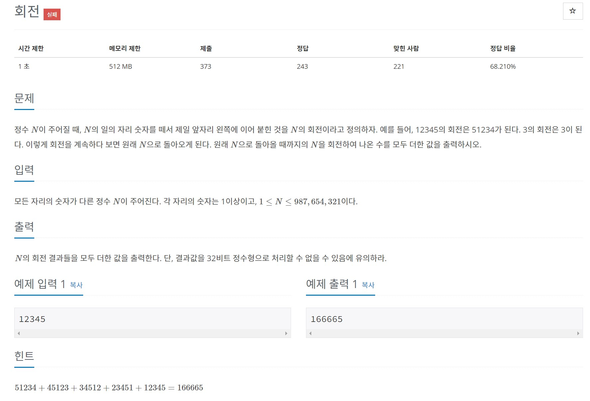

### 회전

**결과값이 제대로 출력되는데 계속 실패가 뜬다... 정수를 선언할 때 8byte 까지 가능하도록 long long 처리를 했고, 가장 큰 범위인 987,654,321 까지 계산이 되는데 실패가 나오는 이유가 뭘까...ㅠㅜ**

    
    #include <iostream>
    #include <vector>
    #include <string>
    #include <queue>

    using namespace std;

    int main() {
        ios::sync_with_stdio(0);
        cin.tie(0);
        long long answer = 0;

        string arr = "";
        cin >> arr;
        int len = arr.size();

        for(int i = 0 ; i < len ; i++) {
            char temp = arr[len-1];
            arr.erase(len-1, 1);
            arr = temp + arr;endl;

            answer += stol(arr);
        }

        cout << answer << endl;

        return 0;
    }

