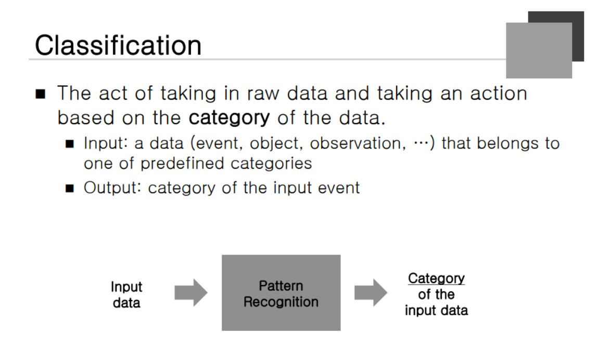
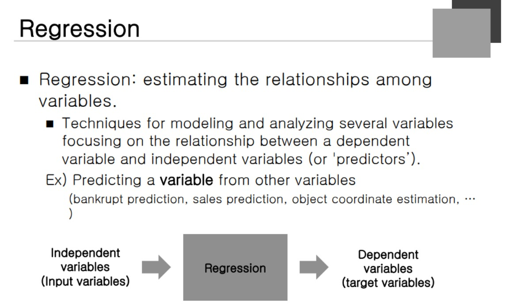
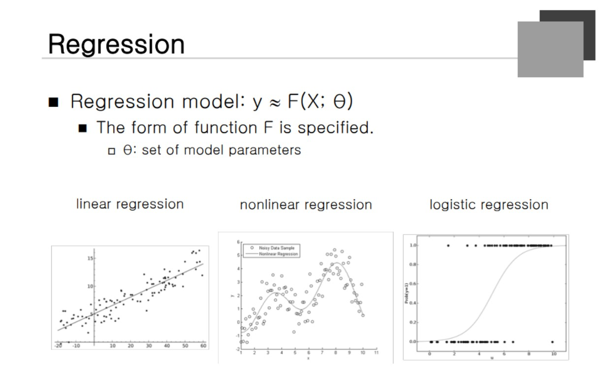
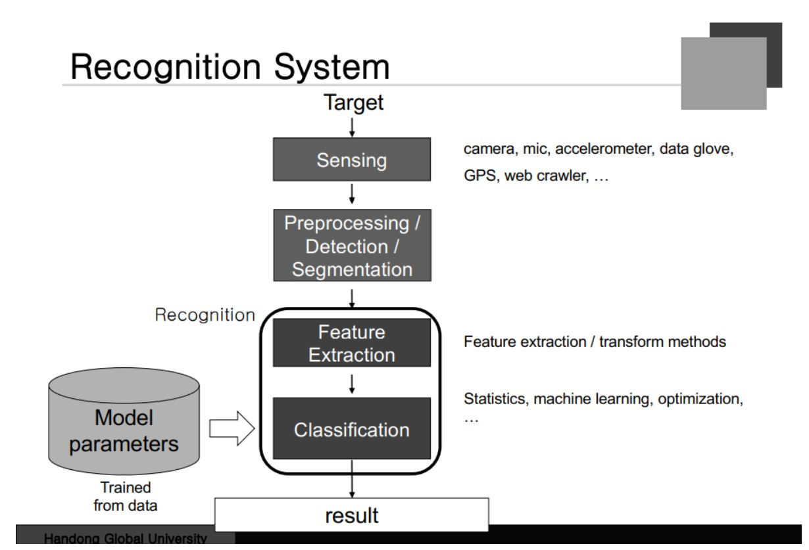
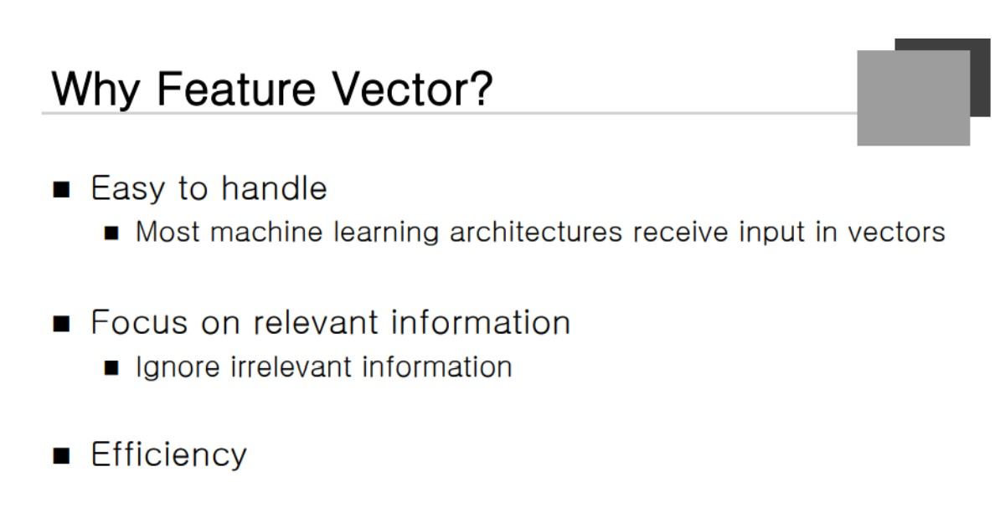
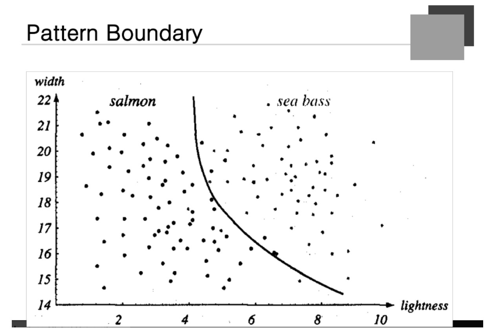
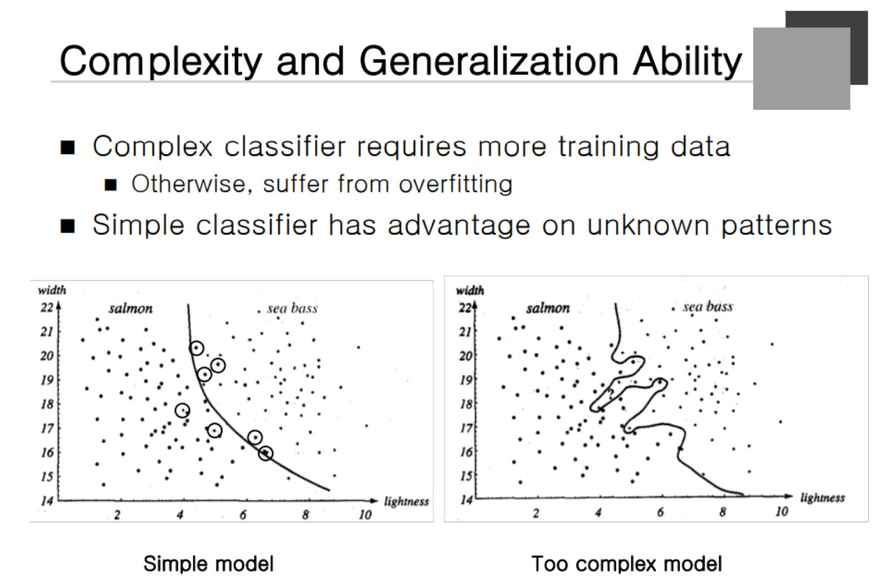
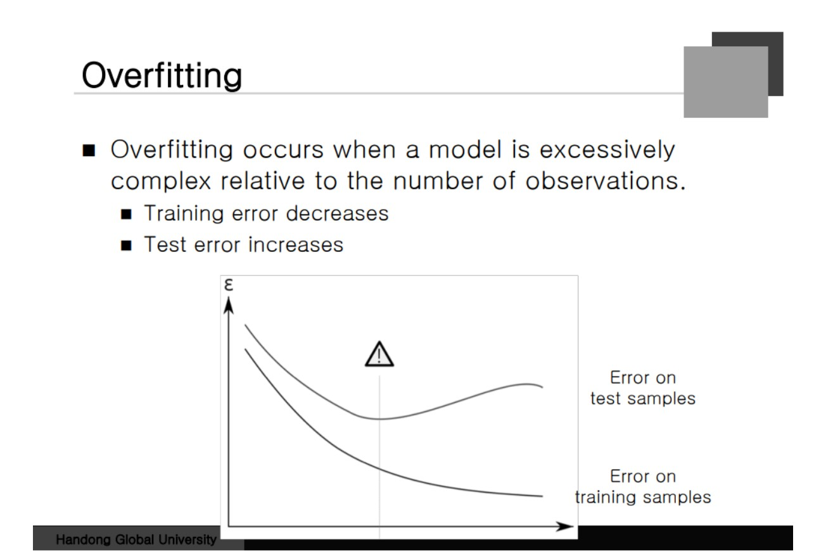

### Classification

입력이 특정한 카테고리 중 하나다라고 인식하는 것. 숫자, 성별, 국적 등 정해진 카테고리 중 하나를 맞추는 문제
입력 = 패턴 , 출력 = Input data의 카테고리

### Regression

value 자체를 맞춰야 하는 문제
Bankrupt prediction 어떤 회사가 부도날 확률을 계산하는 문제가 하나의 예시
Sales Prediction : 몇 개가 팔릴 것 인가
단순한 카테고리 문제가 아니라 Value를 Estimate 하는 접근을 해야 한다.
Input Variable이 주어진다.

### Regression Model

function을 학습한다. y = F(x; 0)
1. linear regression
2. nonlinear regression
3. logistic regression (True False 논리적 값을 추정하는 것)

### Recognition System

문제의 시작은 Target이 있어야 하고 아날로그에서 디지털로 데이터를 가져오는 Sensing을 거친다. 전체의 영상 중 원하는 부분만 잘라내는 과정 Preprocessing 등을 거친다.

해당 Segment를 거치고 Feature Extraction을 통해 데이터로 변환을 한다. 입력하기 좋은 상태로 바꿔져 있으면 0과 1의 상태로 바꿔서 Classification을 하고 result를 얻게 된다.

### Why Feature Vector

**왜 입력패턴을 벡터로 바꿔야 하는가?**

Vector로 만들면 다루기가 쉽다. 거의 대부분의 머신러닝 툴이 입력정보가 벡터라고 가정하는 경우가 많다. 영상의 형태와 크기가 다양할 수 있는 데 고정된 형태로 벡터가 들어와야 처리를 할 수 있다고 가정한 것이 많다. 중요한 정보만을 추출하겠다 Focus on relevant information. 예를 들어 얼굴을 인식할 때 코의 위치 입의 위치 등은 중요하지 않은 정보이므로 Ignore해야 할 경우가 많다. 그리고 효율적이다.

### Pattern Boundary

생선을 잡았는데 하나는 salmon(연어) 이고 다른 하나는 sea bass(농어)이다. 우선 데이터를 벡터로 바꿔야 한다. width 와 lightness에 따라 데이터를 변경한다.

이런 공간을 Feature Space라고 한다. Feature Space에서 구분선을 찾아낼 수 있으면 이것을 Classification의 문제를 해결하는 방법이라고 할 수 있다.

### Complexity and Generalization Ability

**Overfitting의 개념!!**
왼쪽 그림처럼 경계를 그릴 수 있는데 동그라미된 것들은 해당 경계선을 넘어선 부분의 카테고리이다. 몇 개는 맞췄고 몇 개는 틀렸는데 해당 패턴을 모두 만족시키는 경계선을 조정해야 하는가?

모든 패턴을 맞추려고 조정을 하면 오른쪽 그림처럼 Complex 한 model이 만들어진다. 아직까지 관찰하지 못한 새로운 성능에 대한 기능이 높아진다. 지금까지 보지 못한 새로운 샘플이 추가되었을 때 오히려 확률이 높아질 수 있다.

Overfitting은 굉장히 복잡한 경우에 생긴다. 그러므로 너무 복잡한 데이터를 사용하면 안됀다. 복잡한 모델의 기준은..?

데이터가 많은 상태에서는 복잡한 모델을 사용해도 된다. 데이터가 적은 상태에서 복잡한 모델을 사용하면  Overfitting이 굉장히 자주 발생한다. 

### Overfitting
Training에 대한 error와 test에 대한 error의 차이를 비교해야 한다. Training은 시험 공부할 때의 연습 문제, Test는 수능 문제로 비유 당연히 Training data에 대한 성능이 높고 에러가 발생할 확률이 훨씬 낮다.

즉, 공부를 할 수록 틀리는 갯수가 줄어드는 것과 마찬가지 이다. Training data는 학습을 할 수록 낮아지지만 Test data에 대한 error 는 일정 부분 이후로는 증가할 수 있다.

이러한 것을 Overfitting이라고 보는데 training data와 test data의 에러의 격차가 벌어지기 시작하는 시점이 Overfitting이 된다.