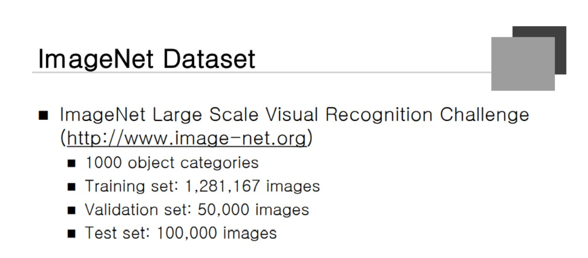
### ImageNet Dataset

영상인식 성능, Image-net이라는 데이터 Set이 있다. 

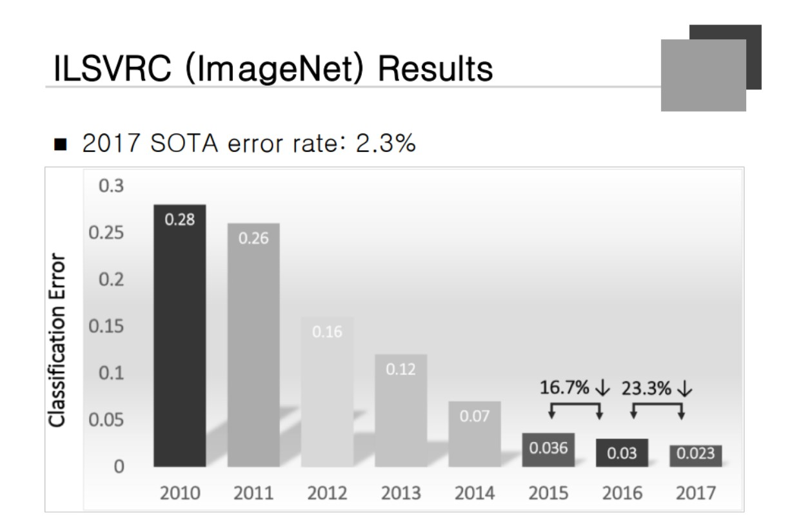
### ILSVRC

2012년 딥러닝이 적용되고 Error Rate가 훨씬 줄었다. 사람의 Error rate는 5프로라고 보면 된다.

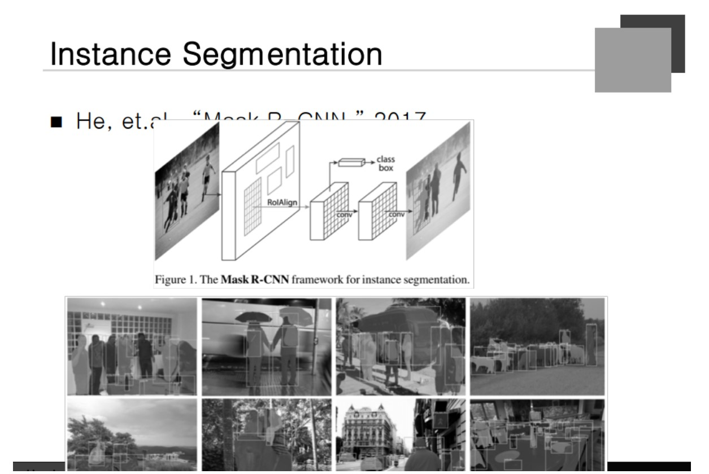
### Instance Segmentation

Object가 어디있는지 찾아내고 Pixel 단위로 실루엣을 만들어주게 된다.

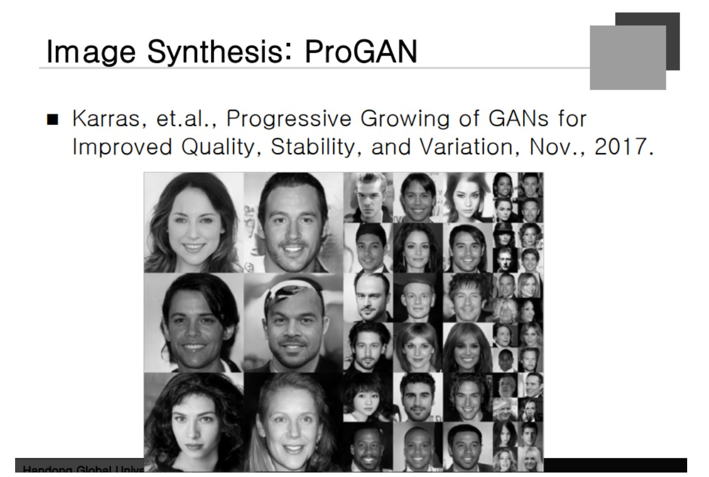
### Image Synthesis: ProGAN

Neural Net이 만들어낸 사람들 얼굴

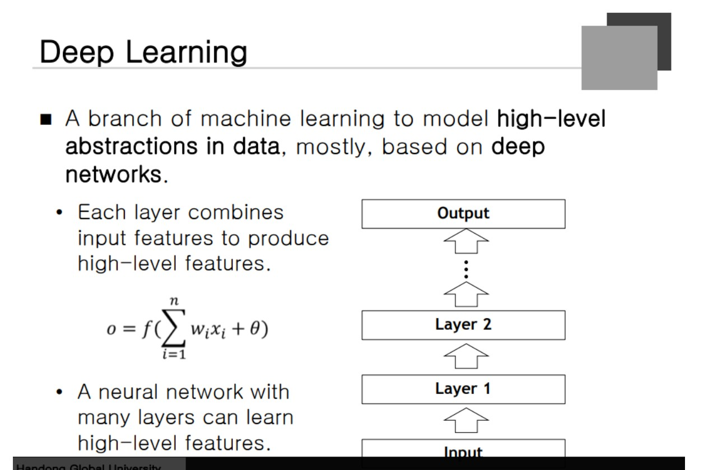
### Deep Learning

Layer가 굉장히 많다. 수십개에서 천 개까지 사용을 한다. 왜 Layer가 많으면 좋은가? 입력 정보를 Merge 하게 되는데 밑에 있는 Layer보다 위의 것이 좀 더 High Level이 된다.

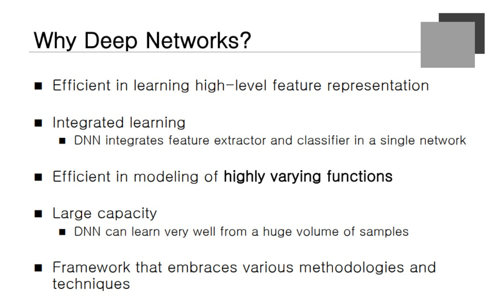
### Why Deep Learning
High-Level feature 

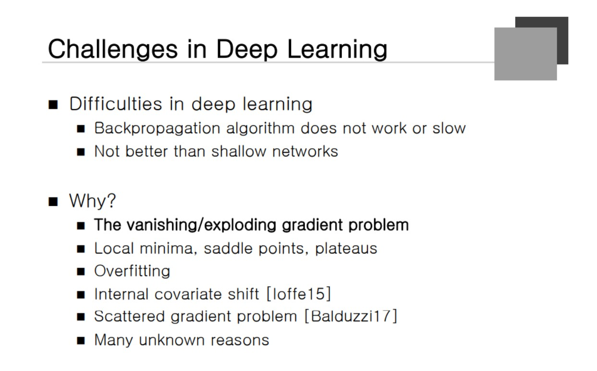
### Challenges in Deep Learning

**Layer가 많아지면 Back Propation이 작동을 하지 않는다.**  Vanishing gradient problem 문제가 있다. 

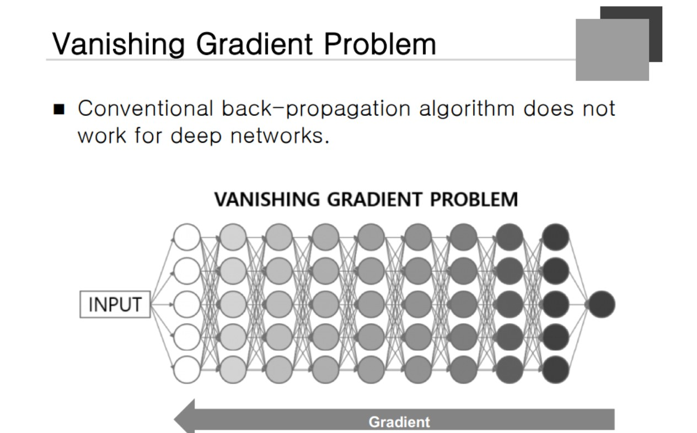
### Vanishing Gradient Problem

뒤쪽으로 갈 수록 Gradient로 갈 수록 희미해진다는 것. 초반에는 학습이 잘 이루어지나 뒤로 갈 수록 학습이 되지 않는다는 것이다.

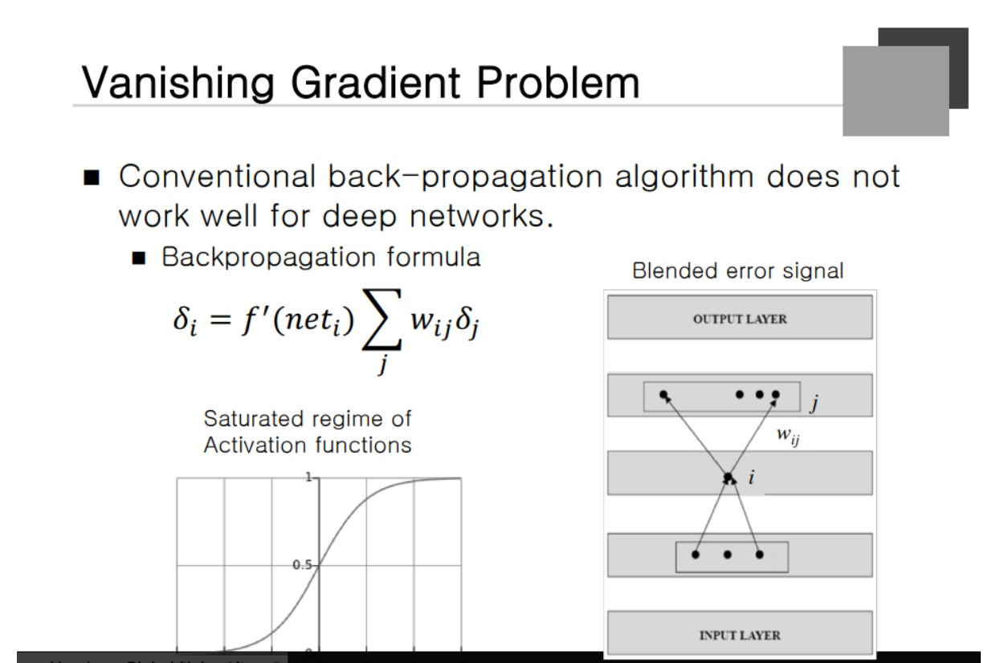
### Vanishing Gradient Problem
i: 밑의 Layer 
j: 위의 Layer

해당 데이터가 있을 때 아래의 Layer를 구하려고 한다. 전통적으로 Neural Net은 Sigmoid를 사용했다. 하지만 1과 -1 주변을 생각해보자 기울기가 완만해진다. **어떤 값의 0에 가까운 값이 계속해서 곱해지면 0에 가까워 진다.** (Saturated Regime 이라고 부른다)

두 번째로 Weighted Sum이라는 형태로 merge가 되는 과정을 거친다. 따로따로 보면 선명한 색을 갖고 잇는 것이 Merge를 하게 되면 **극단적인 값을 가지고 있던 값의 평균 값을 가지게 되므로 각각의 고유한 특징 값이 사라지는 특징**이 있다는 것이다.

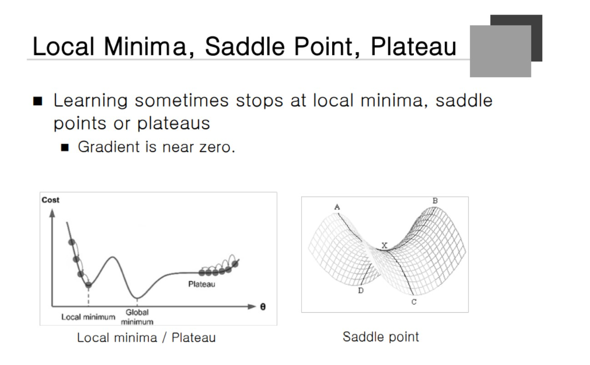
### Local Minima, Saddle Point, Plateau

Error값이 높은데 기울기가 거의 없는 경우 학습이 잘 안되는 Case가 생긴다.

#### Saddle Point
- 어떤 부분에서 값이 최대가 되고 다른 부분에서는 최소가 되는 경우.

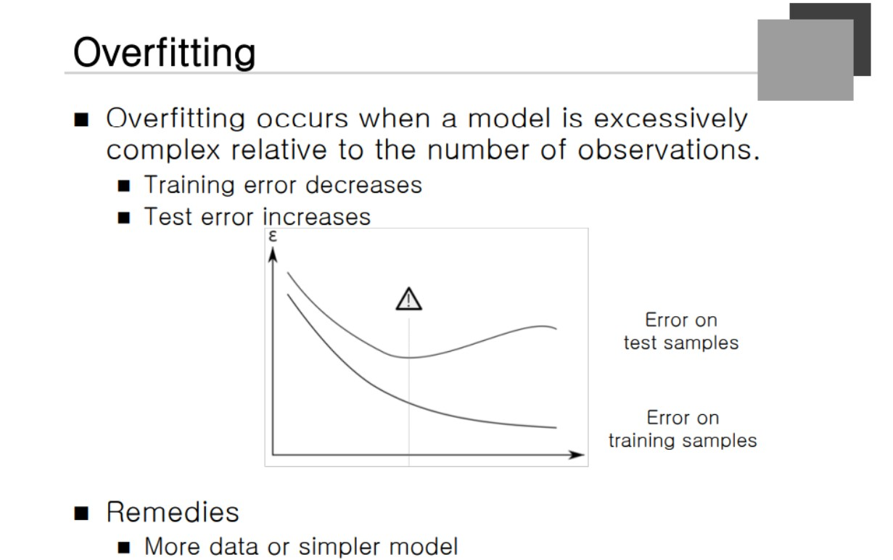
### Overfitting

해결책: 데이터를 많이 모으고 Model을 단순하게 만드는 것이다.

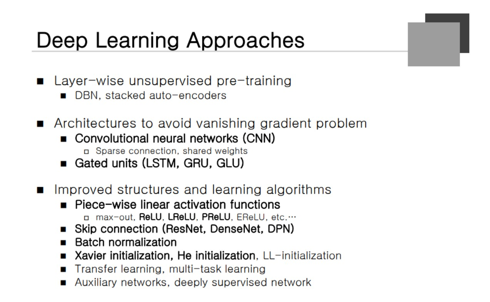
### Deep Learning Approaches

초기에는 Pre-training 모델이 사용됐었다. Network 자체가 Vanishing Gradient Problem을 최소화 할 수 있는 모델을 사용한다. -> Convolutional Nearal Network나 Gated Units가 있는 모델이 그에 해당한다. 

ReLU Function을 사용하면 0 아니면 1이기 때문에 **극한값 주변의 기울기도 1이 나오기 때문에 영향이 적다**는 것이다. 

Skip connection : Nueral에서 굉장히 중요한 역할을 했다. Batch Normalization / Xavier Initialization

