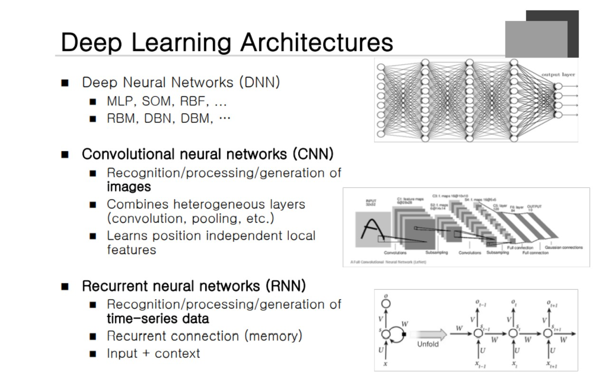
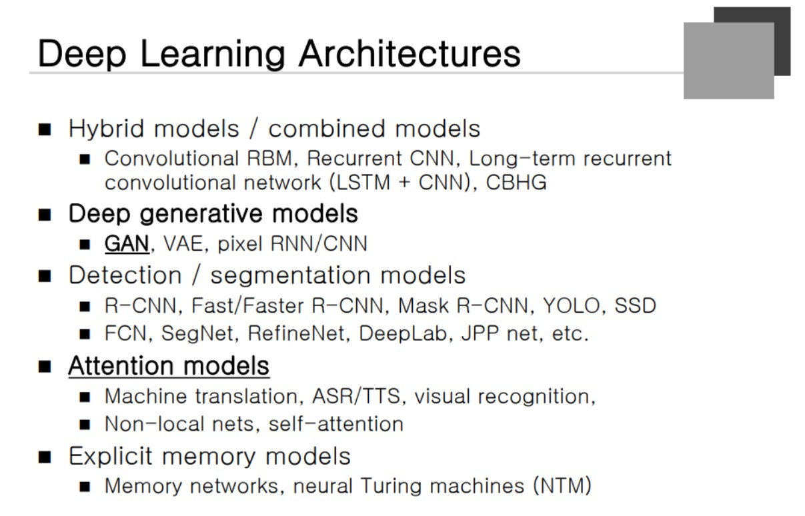
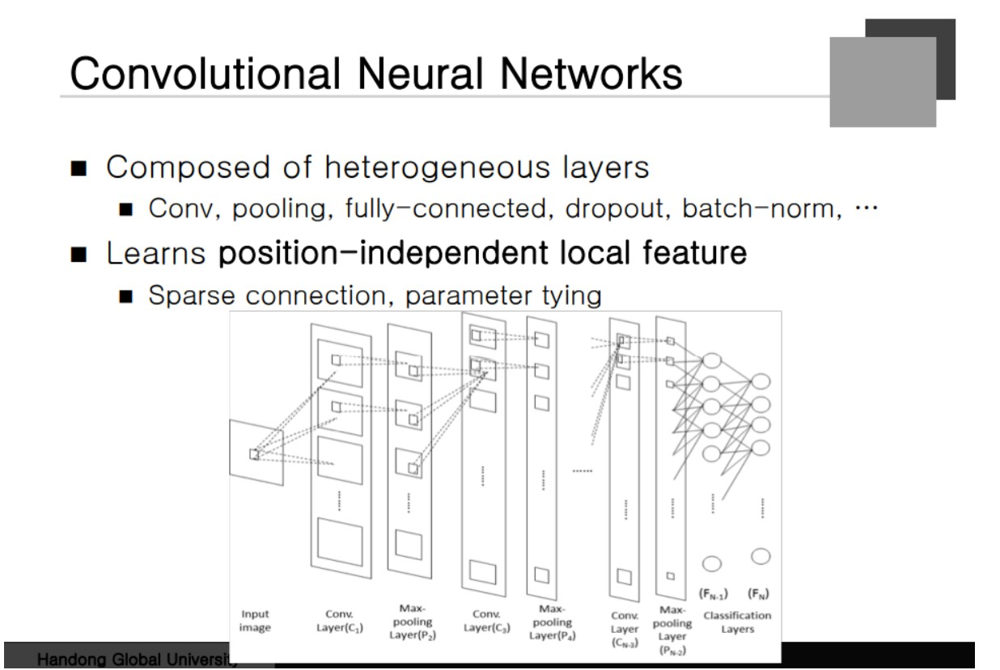
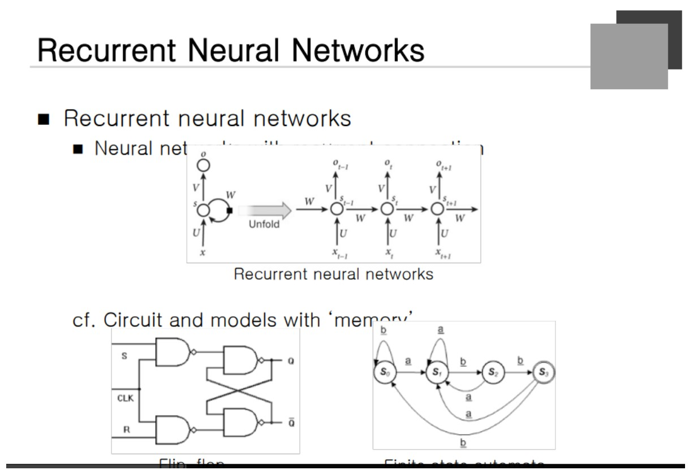
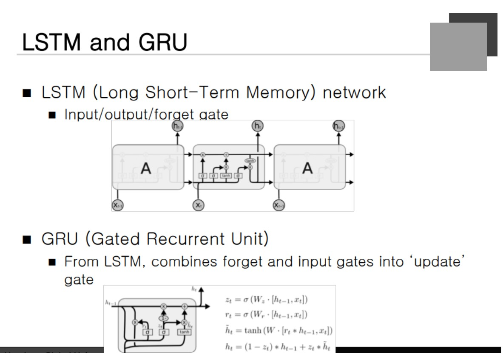
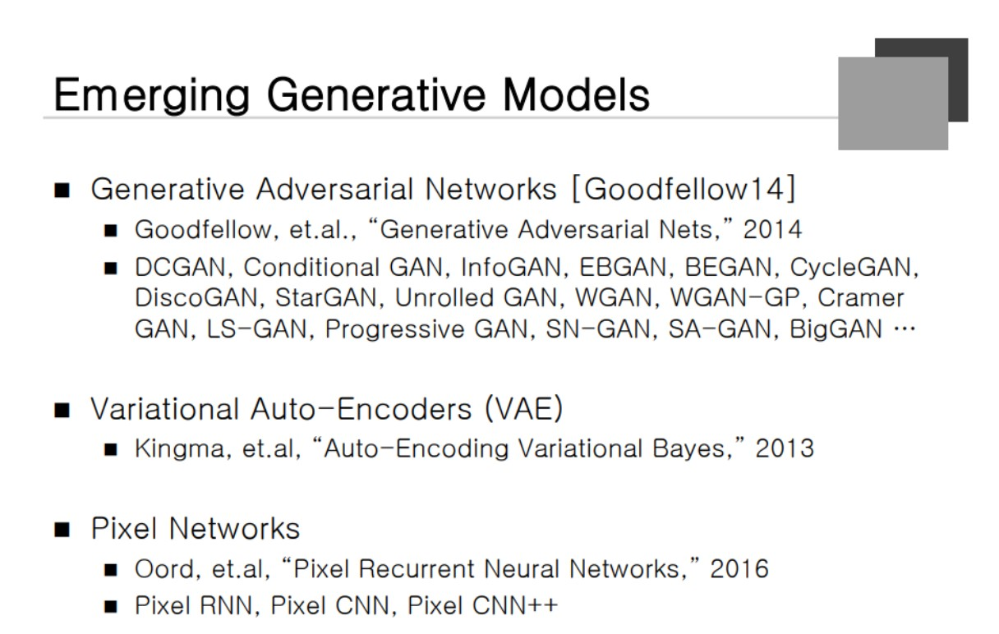
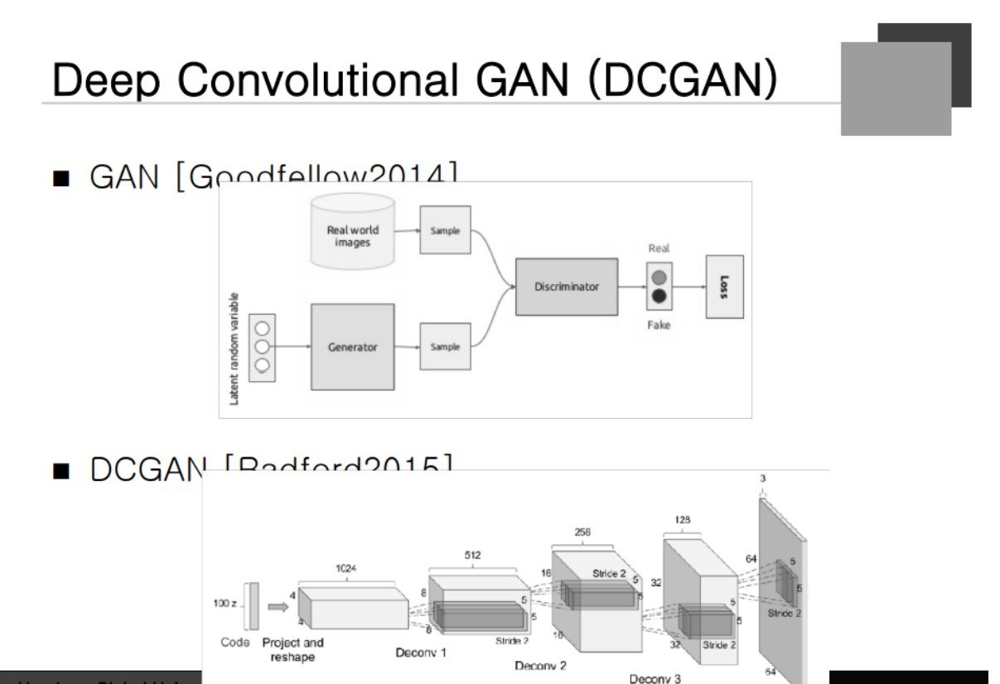

### Deep Learning Approaches

Convolution Layer에서 가장 중요한 것은 Convolution Layer이다. **Position Invariant 한 Local을 feature 한다.** 입력이 들어와서 Output까지 쭈욱 가는 것.

### RNN(Recurrent Nearal Network)

과거가 현재에 영향을 주는 Time-series data의 부분으로 쓰인다. FeedBack을 해주는 Node가 존재한다. **현재의 Input값과 Context가 합쳐져서 사용**이 된다는 것.

### Deep Generative Model

가장 유명한것은 **GAN 네트워크**이다. Attention Model 등이 존재한다.

### Convolutional Neural Network

Layor들이 **3차원 구조**로 구성이 된다. 여러 종류의 Layer가 결합이 되는데 Convolution, pooling , batch normalization layer등이배치된다.

### Recurrent Neural Network
 
Recurrent Connection은 과거에서 현재, 현재에서 과거로 가는 Connection을 의미한다. 이것이 사실 **메모리의 역할**을 하고 있다. Flip Flop의 경우 FeedBack Connection이 존재하기 때문에 마찬가지의 원리로 메모리의 역할을 수행할 수 있게 된다. **Hidden Node의 값을 State**라고 할 수 있다.

과거의 어느부분의 Action을 받아 상태를 전이하는 그림을 나타낸다. **과거의 History를 Summary해서 사용**하고 있다고 볼 수 있는 것이다. RNN을 보면 Hidden Vector가 존재한다. 실제로 저것이 수 백개의 Dimension이 사용된다. **Hidden Vector는 수백 Dimension이 사용되는 좌표와 대응**한다고 볼 수 있다. 저런 Hidden Vector가 좌표를 저장하는 데이터가 된다. 과거의 History를 Summation한 것의 Approximation이라고 볼 수 있다.

### LSTM and GRU

RNN은 **Vanishing Problem**이 극심하게 생길 수 있다. 그 문제를 해결하기 위해 LSTM이 있다. Input과 Output Forget gate를 가지고 있다.

### Emerging Generative Models

### Deep Convolutional GAN

GAN의 학습 방법
**경쟁자를 통한 학습**을 하게 된다. Generator는 위조 지폐를 만드는 사람에 비유를 하고 Discrimator는 경찰이라고 볼 수 있다. Discrim의 입장에서 진짜 Sample과 위조 Sampel의 차이를 학습한다. Generator는 Discrim이 분별해낸는 차이를 없애내는 학습을 계속 진행한다. CNN을 적용시키면 DCGAN을 얻게 된다.