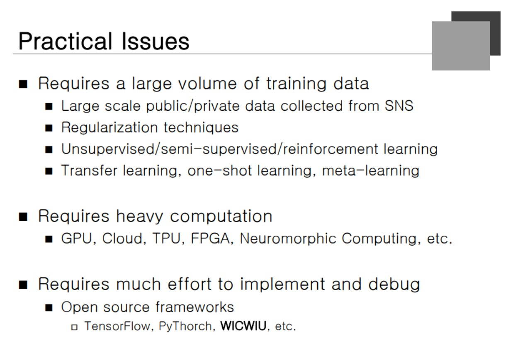
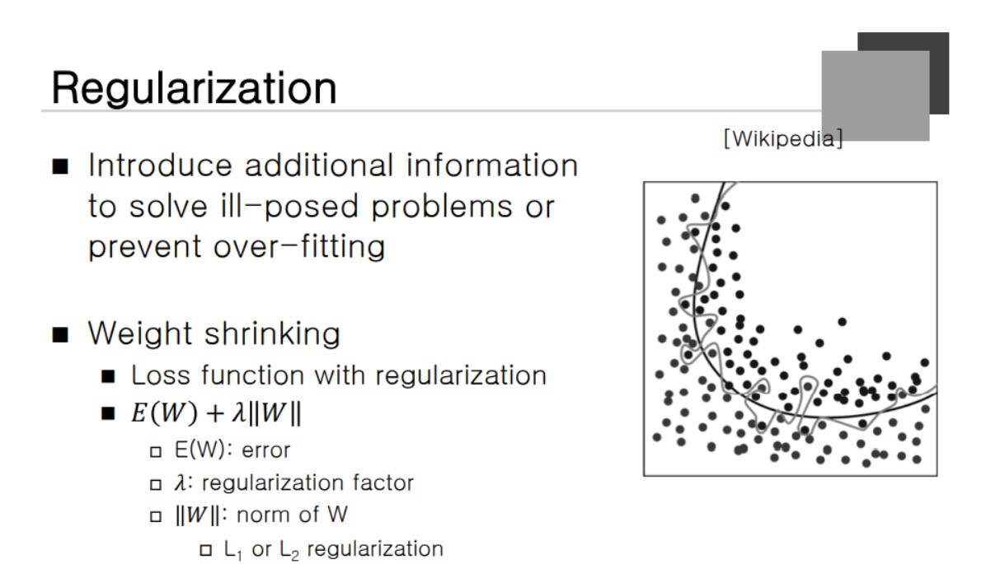
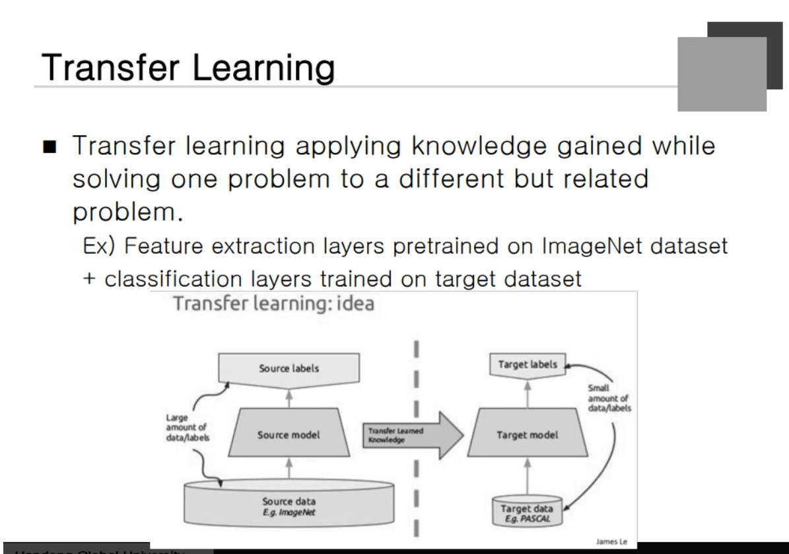
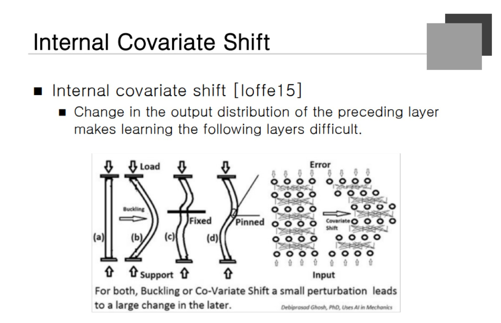
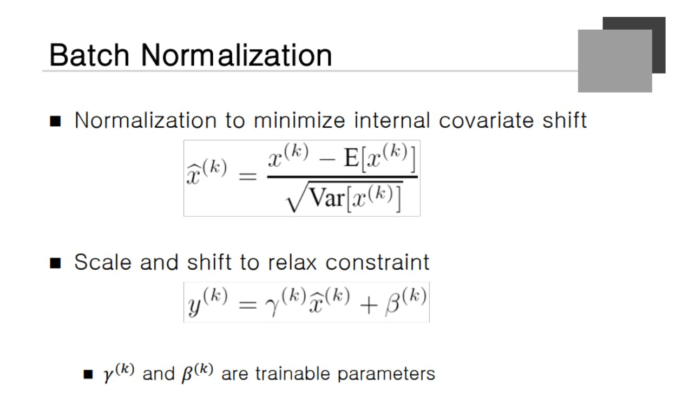
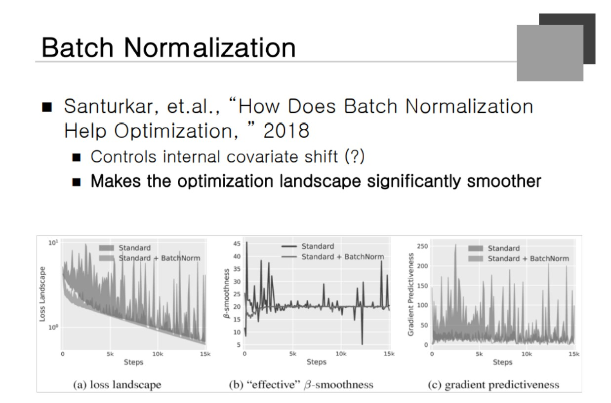
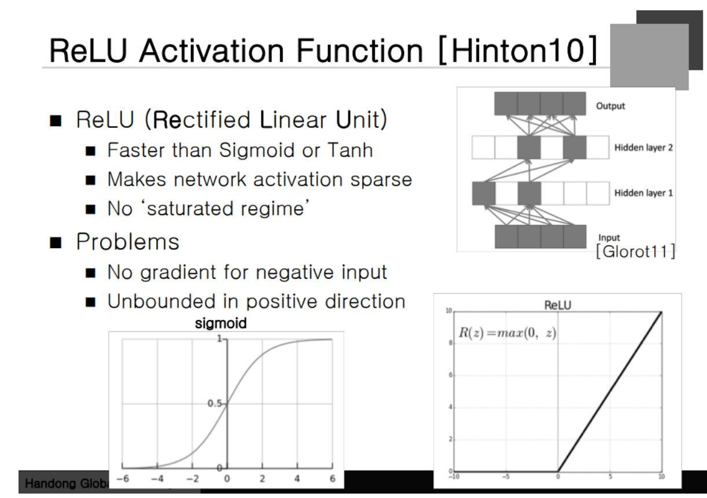
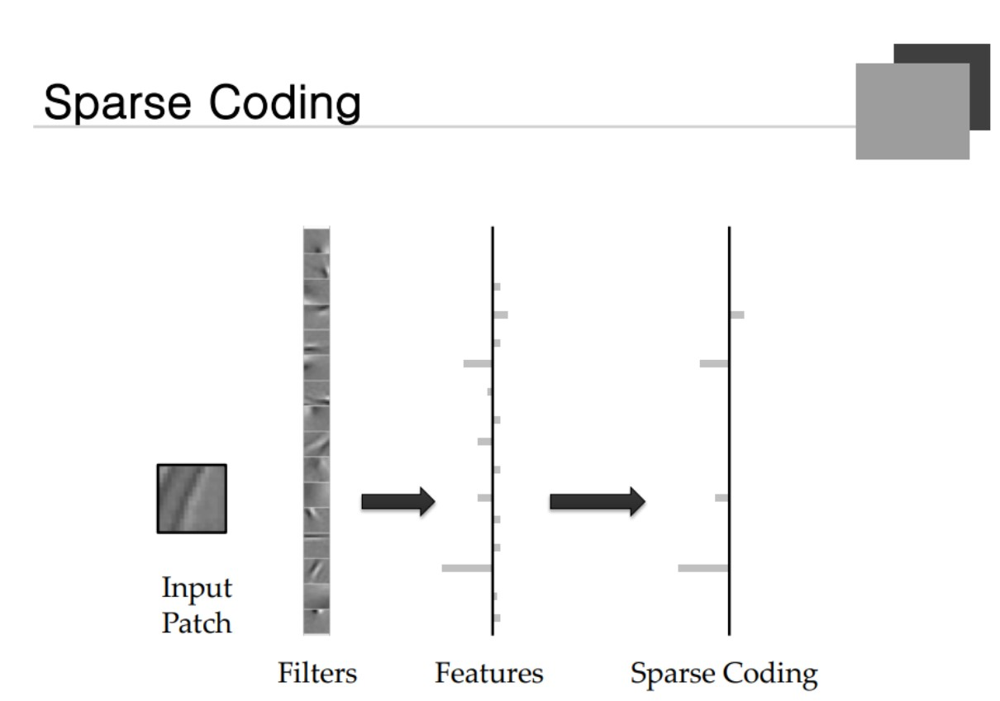

### Practical Issues

Training Data를 많이 필요로 한다. 이에 대한 해결책은 데이터를 많이 모으는 것이고 최근 머신러닝을 하는 사람들이 데이터를 많이 모아놓았다는 것.

#### Regularization techinque / data augmentation 
적은 데이터로부터 많은 데이터를 합성해내는 것

#### Unsupervised / semi-supervised / reinforcement learning
정답이 아닌 피드백만으로 진행된다는 점
Computation 을 많이 필요로 한다.

### Regularization

Boundary가 복잡하면 training data에 대해서는 잘하지만 지금까지 보지 못했던 데이터에 대해서 처리하기 힘들다는 것이었다. **방정식은 적은데 미지수가 많다라고 해석이 가능하다.** 그런  문제를 **ill-posed problem** 이라고 한다. E(W) 의 경우 **Weight에 Constrain을 줘서 많은 학습을 하도록 해야 한다.** norm of Weight 즉, weight에 대한 제약을 주는 것.

### Transfer Learning

전이 학습이라고 표현한다. 한 문제를 학습하는데 있어서의 정보를 다른 쪽으로 적용시키는 것을 말한다. 바둑의 경우 배울 수 있는 테크닉이 장기를 두는데 도움이 될 수 있는가? 에 대한 비유로 말씀하셨다. 

자동차를 인식하는 데이터가 부족한 경우 Neural Network, 대용량 데이터를 쭉 학습한 다음에 중간부의 경우를 새로운 문제에 적용을 시키면 성능이 상당히 좋아진다. 대용량 데이터로 풀 수 있는 문제를 잘 학습시킨 후 Classification Layout을 **내가 풀 수 있는 문제로 바꾼 후 추가 학습을 진행한다면** 효과를 기대할 수 있을 것이다.

### Internal Covariate Shift

**밑에서 어떤 분포를 갖고 있다라는 가정**으로 학습을 하게 된다. 그런데 학습이 되는 동안 밑의 Layer들이 학습을 하게 되고 Conversion 된 상태에서의 **분포가 서로 맞지 않아서** 위쪽 layer의 학습효과가 떨어지는 현상을 Intercal Convariate Shift 라고 한다.

### Batch Normalization

x의 평균을 빼고 표준편차로 나누게 되는 정규화 과정을 Batch Normalization이라고 한다. **밑 Layer의 Batch를 표준화 시켜주는 과정**이 된다.

### Batch Normalization

원래 Internal Covariate Shift를 해결하기 위해서 나온 개념이지만 다른 것에 효과가 있다는 것이 밝혀졋다.

### ReLU Activation Funciton
**좋은점**
1. 빠르다. Exponension이 들어가지 않고 maximun 연산 하나이다.
2. 여러 정보가 하나의 노드에 merge되어 특징이 섞이게 된다. (Hidden Layer)
Non Zero의 값을 갖는 노드가 적게 유지할 수 있다.
3. 도함수가 0에 가까운 값을 가지지 않기 때문에 영향이 적게 발생한다. 
안좋은 점
1. Negative한 점에 대해서는 학습이 전혀 이루어지지 않는다.
2. Positive 방향에 대해서 Boundary가 없다. 
이렇게 되면 Deep Network와 RNN에서 문제가 발생한다. 수학적으로 Overflow가 발생할 수 있다.

### Sparse Coding
Dimenstion 자체는 클 수 있지만 **작은 Neural 만을 잡아내서 노이지를 없애줄 수 있다.**