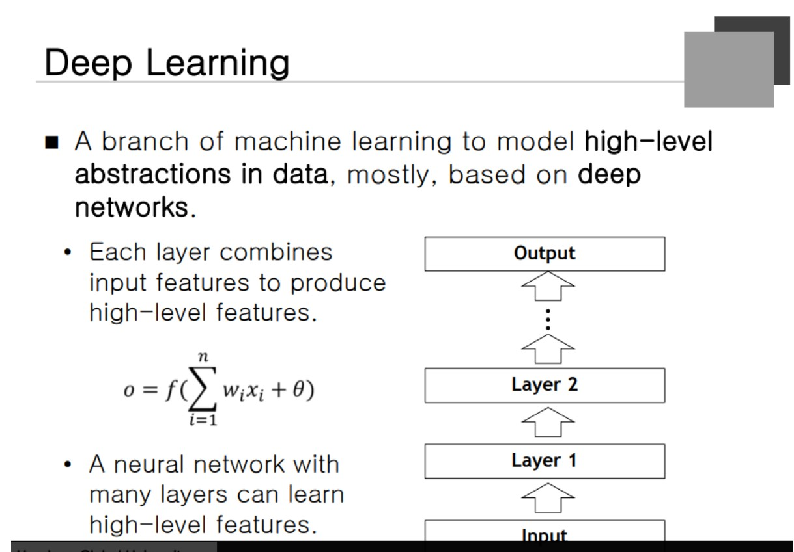
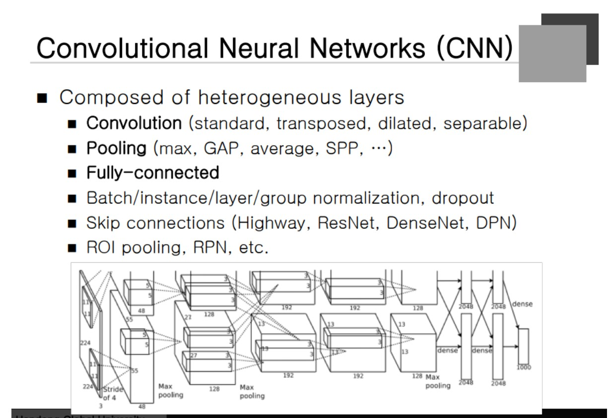

### Deep Learning

Layer가 많은 심층 신경망을 사용하고 layer 하나는 Weighted Sum을 활용한다. W는 데이터로부터 학습을 하는 파라미터이고 마지막에는 Loss function을 정의한다. **즉, 모든 Layer의 Weight를 최적화하는 것.** 이를 결정하는 과정이 학습하는 과정이 된다. Layer의 각 Operation은 입력 정보를 Weighted Sum으로 merge하는데 **어떤 비율로 Merge 하는가**가 포인트

### Deep Learning Architecture

**CNN** -> 영상처리, 자연어, 음성인식
병렬 처리에 의한 속도 향상을 더 잘 이끌어낼 수 있다.
**자연어** : Machine Translation의 효과가 더 있었다.
**RNN** -> Time-series Data를 처리하기 위해서 만들어졋다. 하지만 속도가 느리다.
병렬화를 위해 만들어진 구조가 아니라는 것.

### Biological Discoveries

고양이를 가져다 눈앞에 자극을 주고 뇌의 어느 부분에 반응이 있는지 분석을 했다. 시각 신경에 반응이 있었고 더 깊은 곳을 갈 수록 더 복잡한 반응을 했다는 것이 밝혀졌다. **Visual System의 나타나는 반응은 성장하면서 배운다라는 것이 밝혀졌다.**

### Convolutional Neural Network

처음 제안되었을 때는 Training algorithm이 좋지는 않았다. 하지만, 1998 Gradient Descent 로 발전을 하고 2012년 대회에서 우승을 이끌어 냄

### Convolutional Neural Network(CNN)

3차원적인 구조를 가진다. channel, row, column으로 불린다. **계산량이 엄청나게 많기 때문에 GPU를 이용해서 병렬처리**를 한다. 더 많은 계산을 동시에 할 수록 병렬 처리의 이점을 취할 수 있다. Sample을 한 개 주고 병렬처리를 하면 효과가 없기 때문에 여러 개의 Data를 주입한다. batch는 Group화 한 것을 말하고 GPU의 성능을 최대로 활용할 수 있도록 도와준다.

**mini batch의 크기가 32라면 32D가 되는 것이다.** 가끔 5차원 정보가 될 때가 있는데 추가되는 하나의 축은 time이 된다. CNN 개념에 RNN의 개념이 포함될 수 있다. +batch +time. 개념적으로는 3차원이지만 현실적으로 4차원의 데이터를 저장한다.

### Convolutional Neural Network(CNN)

첫 Layer는 대부분 Convolutional Layer를 사용한다. 다음 Layer들은 다양한 Layer를 교차시켜 사용을 한다. 오른쪽(뒷쪽)으로 갈 수록 두 세개 정도의 Fully connected Layer가 존재한다. 2012년도에 CNN이 널리 알려지게 됬는데 그 당시 대부분이 Convolution, Pooling, Fully-connected Layer로 구성이 되어있었다. 그 중 가장 중요한 것이 Convoluitional Layer이다. 

이에는 종류가 다음과 같이 여러개 존재한다. **Pooling layer는 여러 Dimension에 존재하는 feature들을 적은 Dimention으로 줄이는 역할**을 한다. **Fully-connected layer는 Targeting을 하는 역할**을 한다. 전통적인 방법에는 Fully connected Layer를 많이 사용했다.

### Convolution Layer

영상 처리에서 많이 쓰였던 Convolution operator와 동일하다. 입력 영상이 있고 Convolution mask (3x3 5x5)를 영상으로부터 통과시키고 한칸씩 이동하여 스캔을 완료한다. x의 (n-1)을 밑 Layer의 Feature라고 할 수 있다. 

### Convolution Operation

알고리즘이 같다고 하더라도 **Mask의 값에 따라 완전히 다른 것을 만들 수 있다.**

CNN에서 **Convolution Mask가 Weight에 해당**한다. 이 Convolutional mask 자체가 학습을 해야 하는 Weight가 된다.

### Convolution Layers

Multi channel 로 구성되기도 한다. **해당 Neural을 결정하는 channel이 한 개가 아니라 여러 개일 수도 있다.**

### Dilated Convolution(astrous Convolution)

mask의 dense가 좀 넓다. 예를 들어 두 칸에 하나를 뽑아내는 등으로 **계산량이 감소**하게 된다. Weight의 개수도 감소하게 되고 파라미터도 줄어들며 Training이 더 수월해진다.

**3x3 mask가 5x5 영역을 커버하고 있으므로 적은 파라미터로 넓은 Context를 처리할 수 있게 된다.**

### Convolution Layer
영상 처리에서 많이 쓰였던 Convolution operator와 동일하다. 입력 영상이 있고 Convolution mask (3x3 5x5)를 영상으로부터 통과시키고 한칸씩 이동하여 스캔을 완료한다./
x의 (n-1)을 밑 Layer의 Feature라고 할 수 있다. 

### Separable Convolution

2차원 Convolution을 적용하고 **Channel간 이루어지는 Convolution이 이루어진다.**

### Max-Pooling Layer

입력 feature map을 일정한 크기로 나누고 **Maximum 값으로 작은 Map을 만든다.** 어떤 영역으로 들어오게 되는 데이터는 하나의 성분이다!! 라는 개념으로 사용되고 그 중 **가장 센 값이 대표 성분을 가진다라고 판단**하여 최대값을 택하게 된다. 