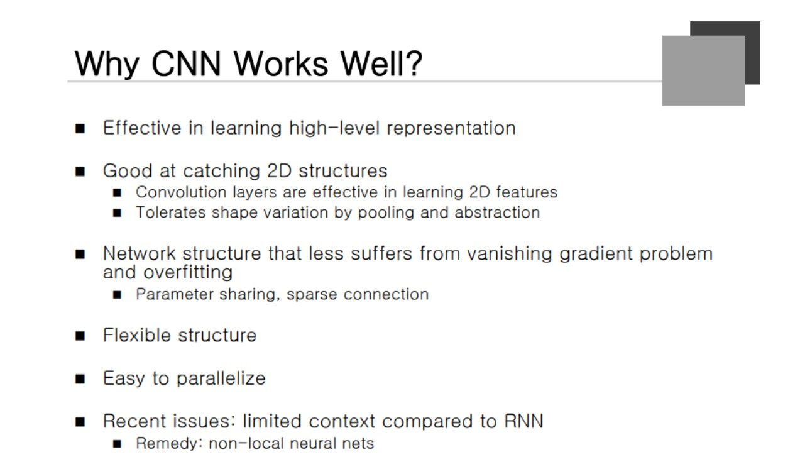

### Fully connected Layers
Neural Network의 마지막에 Classification 또는 Regression을 수행한다. 많이 사용되는 Regression이 Detection이다. **어떤 오브젝트가 있을 때 Bounding Box를 찾아내는 것**을 의미한다. 이것이 Regression 문제로 풀린다.

### CNN in PyTorch

파이썬에서 클래스를 정의하는 문법. nn.Modulel이라는 클래스를 상속받아서 Net을 정의하겠다.

def는 메소드에 해당하는데, __init__ 은 컨스트럭터에 해당한다. Neural Network를 정의했다.

입력 Layer(RGB)가 들어와서 6개의 Feature를 만들어낸다. 그 다음 Max-pooling을 통해서 절반 크기로 줄인다. 다시 Convolution을 통해서 16개짜리로 만들고 다시 Max-pooling을 한다. 이렇게 되면 크기는 작고 개수는 여러개인 Layer가 존재하게 되는데 다음에 Fully connected Layer를 넣었다. 120D -> 84D -> 10D 으로 통과시킨다.

Conv2d를 호출할 수 있다.(라이브러리 사용) MaxPool2d 클래스를 호출해서 사용할 수 있다. fully connected Layer를 Linear라고 파이토치에서 부른다. 

forward 함수를 하나 정의한다. x를 conv1에 넣어서 동작을 시키고 그 결과를 ReLU 함수에 입력시킨다. 즉, Weighted Sum을 Activated Function에 통과시킨다.

pooling을 시키면 가로가 절반, 세로가 절반으로 줄어들게 된다. x 라는 변수는 Convolution을 한 번 통과한 데이터가 되고 이를 다시 한 번 통과시킨다.

다음 x.view라는 function이 있는데 이는 데이터의 모양을 바꿔주는 Operator가 된다. 5*5 가 16개 있는 모양이 된다. 3차원 Tensor를 1차원 Tensor로 바꿔주는 과정을 거친다. net = Net() 은 Object를 만들어주는 과정이 된다.

### Why CNN Works Well?

High-level을 잘 캐치하고 2차원 구조를 탐지하는데 굉장히 탁월하다. 예를 들어 **동영상을 인식하는 경우 시간 축까지 포함되어서 3차원 CNN을 사용하게 된다.** Vanishing gradient를 억제해주는 좋은 구조이고 Overfitting이 적게 발생한다.

Fully Connected는 Parameter가 너무 많다. 반대로 CNN이 계산량이 엄청 많다. 구조 자체가 Flexible하다. **동일한 Layer가 아니라 여러 종류의 Layer를 합성해서 만든 것이므로 굉장히 유연하다.** 그러므로 굉장히 많은 아이디어를 커버할 수 있는 것이 CNN이다. 병렬화를 할 수 있음에 많은 이득을 취할 수 있다.