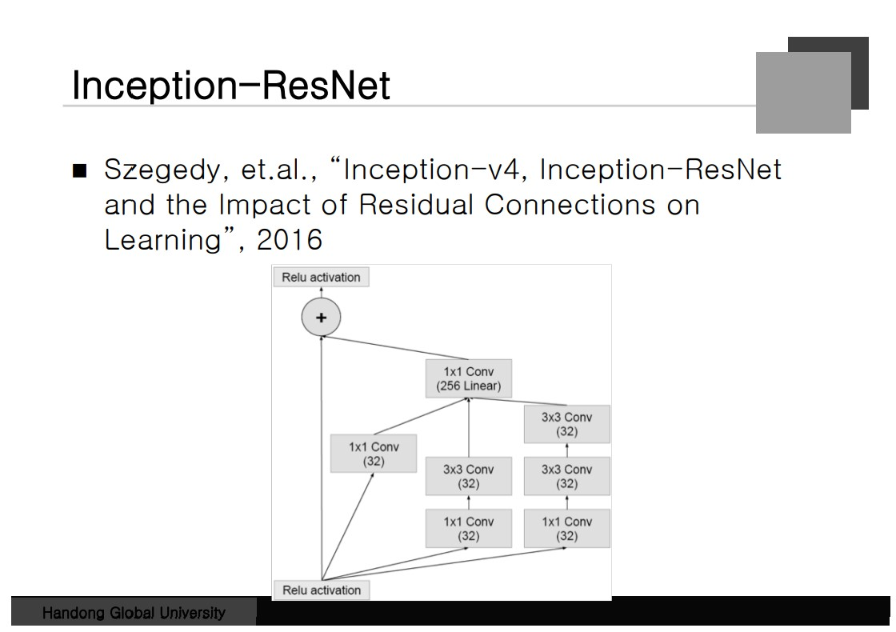
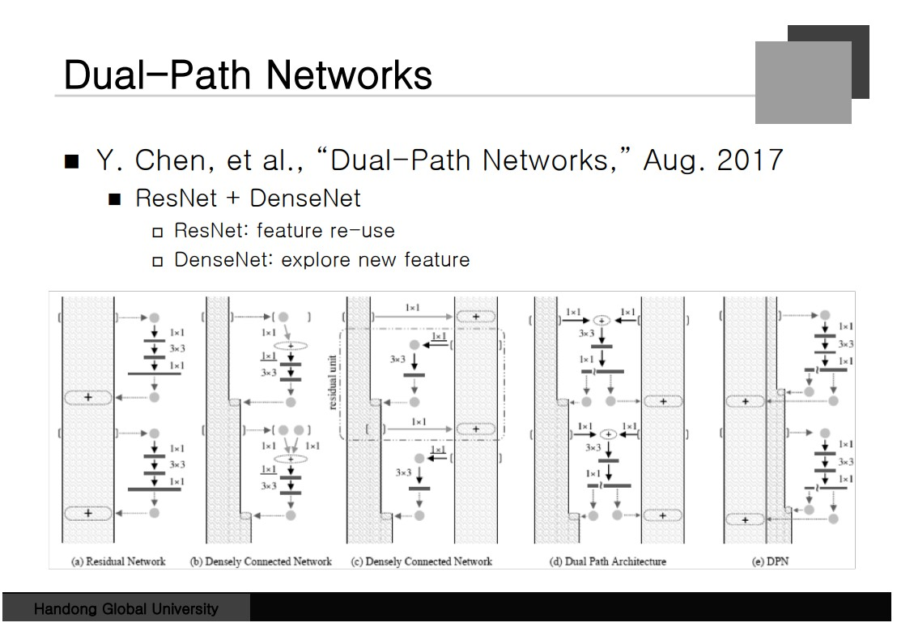
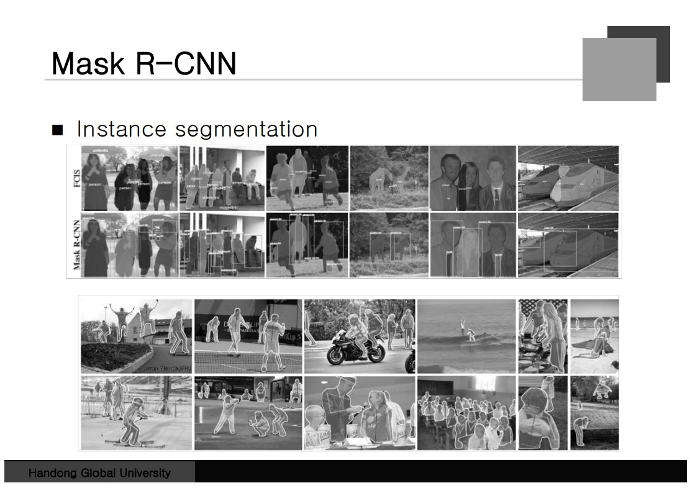

### MLPconv Layer
일반적인 Convolution Layer는 Mask가 하나 있고 weighted sum을 해서 집어넣게 된다.
Linear 필터 뒤에 MLP를 붙여서 Nonlinear한 필터를 학습할 수 있게 만들 수 있다.
Layer 속에 Network가 있는 것이다. "Network in Network"라고 불린다. 
**일반 Conv를 붙이고 1 * 1 Conv를 붙이면 MLP와 똑같은 Operation을 가질 수 있다.**
실제적인 구현은 conv + CCCP + CCCP + ... 이렇게 구현할 수 있다.
**1*1 Conv의 사용은 Feature Map의 개수를 줄이는 데 사용이 된다.**  전체적으로 
Dimension을 줄이는 역할을 한다.**Max-Pool은 크기를 줄이지만 CCCP는 개수를 줄인다.**

### Global Average Pooling
맨 마지막 Layer의 **Classification을 위한 Layer**이다. 다음과 같이 Fearture map이 있으면 
전체의 평균을 구해서 Node 하나에 집어넣는다. output Node 하나로 Mapping이된다.
이것이 어떻게 Classification을 해결해주는 것인가? **각 채널이 클래스를 대표하므로 그 클래스를 평균화 하면 범주화할 수 있다는 이론**이다. 

### VGG Net
Depth를 키운 Net이다. mask가 크면 넓은 Context를 볼 수 있지만 작은 특징을
뽑아야 하는 경우 간섭을 많이 받게 되고 반대도 마찬가지로 안좋은 점이 존재한다.
**3x3을 겹쳐서 사용하면 전체적으로 5x5 영역을 커버할 수 있다**. NonLinearity가 더 
강력해 진다는 특징이 있다. 파라미터의 숫자도 줄어든다. 실험적으로 봤을 때 
3x3을 여러 개 겹쳐서 사용하는 것이 더 좋은 성능을 낸다는 것이 확인되었다.
Classification인 경우 3x3을 겹쳐서 사용하는 것이 좋고 
한번에 큰 경우를 봐야 하는 경우는 큰 Filter를 사용하는 것이 불가피 하다.

### GoogLeNet
Inception Module에 대해서 알아보자. 1x1 3x3 5x5, 경우에 따라 선택하면 좋은 Filter
가 존재하므로 선택지를 주는 것이다. **(b)에 1x1을 넣는 이유는 Feature Map의 개수를 줄일 수 있기 때문이다.**

### Residual Learning
Depth가 깊으면 깊을 수록 Power가 깊어진다. 하지만 학습이 잘 안돼는 경우가 발생한다.
보통 30~40 Layer를 사용했고 그 보다 많으면 학습이 잘 안됐다. **처음 제안된 아이디어는 마지막 Layer에 Identity function을 사용하면 된다는 것이다.** 학습하려는 Function을 H라고
표현을 한다. x는 입력이고 입력에 하나의 Term을 거쳐 H를 구성하게 된다. **Neural Net은 x를 학습하는 것이 아니라 F를 학습한다.** Residual Function에서 입력과 H의 차이를 구한다.
입력에서 Connection을 뽑아서 마지막에 더해버리면 전체 H Function을 구할 수 있다.
F Function이 작은 값을 내주도록만 해주면 Identity function과 동일하게 만들 수 있다.

### Residual Learning
구조적인 변화는 Skip Connection 하나인테 성능을 어떻게 개선을 시킨 것일까?
Shellow Network를 병렬적으로 연결된 효과를 낸다는 것이다. 

### Inception-ResNet: Activation Scaling
ResNet을 사용하더라도 Filter를 1000개 이상 사용하면 Network가 죽는다는 것이다.
**이때 Activation Scaling에 0.1 ~ 0.3 을 곱하면 학습이 더 잘된다라는 것이다.**

### Dense Net
자기 앞에 있는 모든 Layer하고 연결이 되어있다. 모든 Layer에서 모든 Layer로 가는
Connection이 존재하게 된다. Dense Net처럼 만든 이유는, ResNET에서 기대하는
효과를 얻을 수 있기 때문이다. Skip Path를 통한 학습이 되기 때문이다.
Low Level Feature가 중요한 경우 계속적인 학습을 거치는 것보다 **Skip Path를 통해 추가적인 High Feature를 학습시키면 성능이 더 좋아진다는 것이다.** 

### Dual-Path Network
ResNET과 DenseNET의 장점을 둘 다 취한 network이다. Densely Connected Network
가면 갈 수 록 더 많은 Feature Map이 저장된다. ResNET은 재사용을 하게 해주고
DenseNet은 새로운 Feature를 활용할 수 있게 해준다고 정리한다.

### SENet
Sqeeze and Excitation, Feature Map마다 중요도를 할당해 강조하는 Map이 달라진다.
Data에 따라 중요한 채널이 달라진다는 점을 사용하는데, 각 채널마다 하나의 대표값을
뽑아서 Vector를 만들게 된다. Average Pooling을 활용. 그 벡터를 하나의 NN를 통과시켜
동일한 크기의 벡터를 하나 생성하게 된다. 거기서 나온 값의 중요도에 따라 이전 Feature Map에
곱하게 된다. 구조는 같지만 중요한 것의 값이 커지고 강조된다. 어디에 Focus를 둬야 하는지
넣어주고 결과를 확인하는 Network로 활용할 수 있다. 

### Weight Initialization
Shallow Network는 -0.01 에서 0.01범위의 무작위 숫자를 사용하면 된다.
Input Degree와 Output Degree의 값을 찾고 Xavier Initialization을 사용하면 
분산을 구할 수 있다. He Normalization은 Input Demension 으로 나눈 값을 사용한다.
weight를 0으로 초기화하면 Gradient가 같은 값을 가진다. 

### Bias Initialization
일반적으로는 0으로 초기화를 한다. 약간의 변이를 주는 경우가 있는데 ReLU를 사용할
경우 음수가 나오면 0이 나온다. 0이 나오게 되면 학습이 안되므로 0보다 크고 싶을 때
작은 양수값을 줘야 한다. (실험적으로 진행하면 된다.) Bias가 0이어도 가능한 이유는
Bias는 네트워크가 가지고 있는 편향성을 의미하는데 큰 값을 가지고 시작하면 치우친
방향으로 학습이 될 가능성이 존재한다. 다음은 일부로 큰 값을 주는 경우가 존재한다.
LSTM이라는 NetWork를 보면 Forget Gate가 있는데 과거의 정보를 미래로 전달을 하는데
가끔은 통째로 잊어버리면 좋은 경우가 존재한다는 것이다. 

### Batch Normalization
동일한 batch에 존재하는 sample은 Standardization을 진행한다.
이러면 밑의 분포가 바뀌더라도 어느정도 표준화를 통해 전체 분포를 유지시킬 수 있다.
하지만 문제는 이렇게 강제로 해버리면 NN의 Capacity가 줄어든다는 것이다.
획일화를 시켜버리면 변화할 수 있는 여지를 제한해버리는 것이다. 
감마를 곱하고 베터를 더하는 Linear한 식을 하나 정의할 수 있는데, 이것이 해결할 수 있다.
학습을 한 값(감마, 베터)을 가지고 식을 만들었기 때문에 Batch Norm에 유리하다. 또한
Feature map들이 모두 공유하는 감마와 베타를 사용하기에 안정적 학습이 가능하다.

### Batch Normalization
"How Does Batch Normalization Help Optimization" 
Internal Converiate SHift를 막아주는 효과때문에 좋은 것이 아니라 내려가는 
Surface를 부드럽게 만들어줘서 Gradient Descent하기에 좋게 만들어준다는 것이다.
파란색 그래프처럼 변동이 확 줄어든다. 

### Layer/Instance/Group Normalization
Batch 단위로 학습이 되어야 한다는 것이다.  Batch를 확보하기 어려운 상화이 존재한다.
Layer에 대해서 표준편차를 구할 수 있다는 것이다. RNN의 경우가 그런데 Layer Normalization을 진행한다.
Batch Norm과 비슷한 성능을 얻을 수 있다. Instance Norm, Group Norm 도 있다.

### R-CNN
CNN을 이용해서 Classification과 Detection을 할 수 있다. 컴퓨터 비전 방법을 이용해서
후보 영역을 뽑아내고 전부 CNN을 통과 시킨다. Classification을 통해서 yes라고 하는 것만을 통과
시키는 것이 R-CNN이 된다. 

### Fast R-CNN
영상 전체에 대해서 CNN을 돌리고 Feature Map이 나오는데 후보 영상을 Feature map에서
자르게 된다. 후보 영역에서 뽑아서 Classification을 할 수 있다. 그냥 R-CNN에 비해서
CNN을 한 번 만 돌리는 효과를 얻을 수 있다.

### Mask R-CNN
영역을 뽑고 Bounding Box를 만들어서 그 안에서 Pixel 단위로 찾아내게 해준다. 

### YOLO
영상이 들어오면 s x s grid로 나누고 Bounding box를 찾아서 