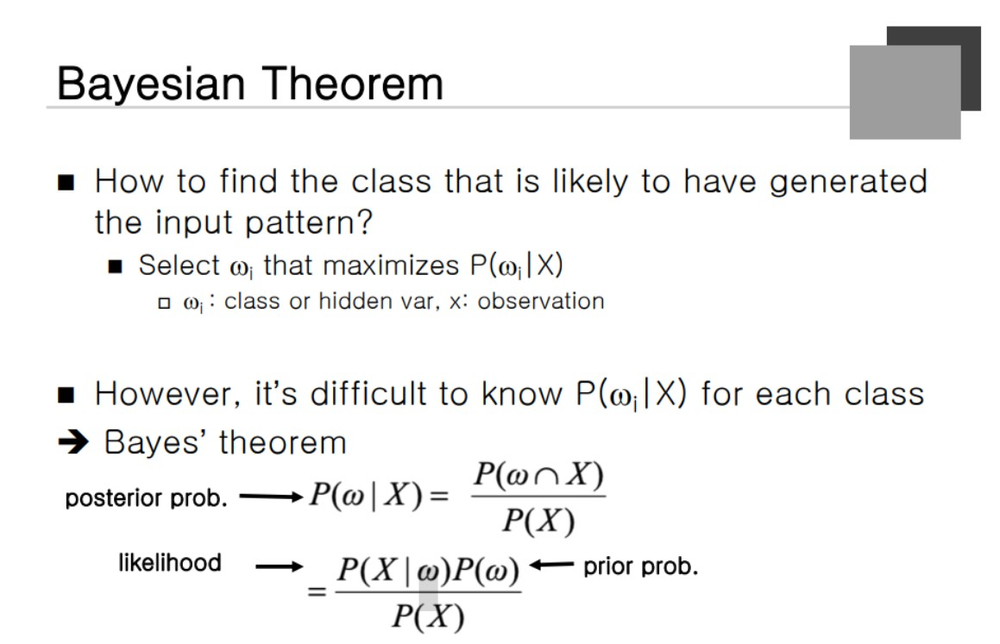
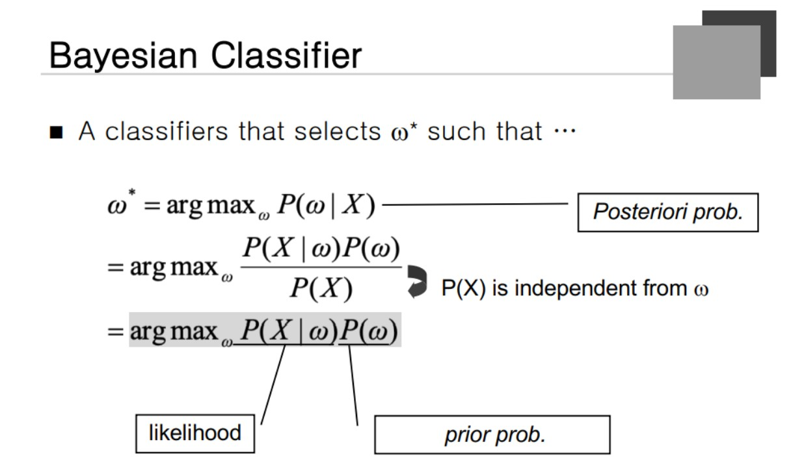

### Bayesian Theorem
Classification 문제에서 몸무게와 키를 주고 남자와 여자를 구분하라는 문제를 생각해보자. 100% 맞추지만 어느정도 맞출 수 있다고 가정을 한다.
오메가1 = 남자, 오메가2 = 여자 , X = 키, 몸무게 등등

해당 Condition을 확률로 나타내게 된다. 해당 확률을 계산하면 남자인지 여자인지를 판단할 수 있는 가능성이 있게 된다. 175cm의 70kg를 모두 모아서 남자와 여자의 수를 세는 것은 굉장히 어렵다. 왜냐하면 모든 경우의 수를 직접 찾아서 나열하는 것은 어렵기 때문이다.

일단 남자를 모두 모아서 키와 몸무게의 분포를 찾고 여자도 마찬가지로 분포를 찾는다. 이 경우 전자의 경우보다 훨씬 쉬운 경우가 된다.  키와 몸무게가 주어진 상태에서 남자인지 여자인지를 판단하는 것을 남자인지 여자인지가 주어진 상태에서 키와 몸무게를 판단하면 똑같이 구할 수 있다는 것이다. Bayesian Theorem 이라고 한다.

앞 뒤의 조건이 뒤바뀌게 되는 경우로 확률을 구하게 되는데 측정하기 어려운 조합을 측정하기 쉬운 조합의 순서로 바꾸는 것을 Bayesian 이론이라고 한다. 

### Bayesian Classifier

**Posterior Prob** : 관찰한 것을 Given으로 주고 원하는 결과를 구하게 되는 것을 후행 확률이라고 한다.
**Prior Prob** : 선행 확률이라고 부르게 된다.
