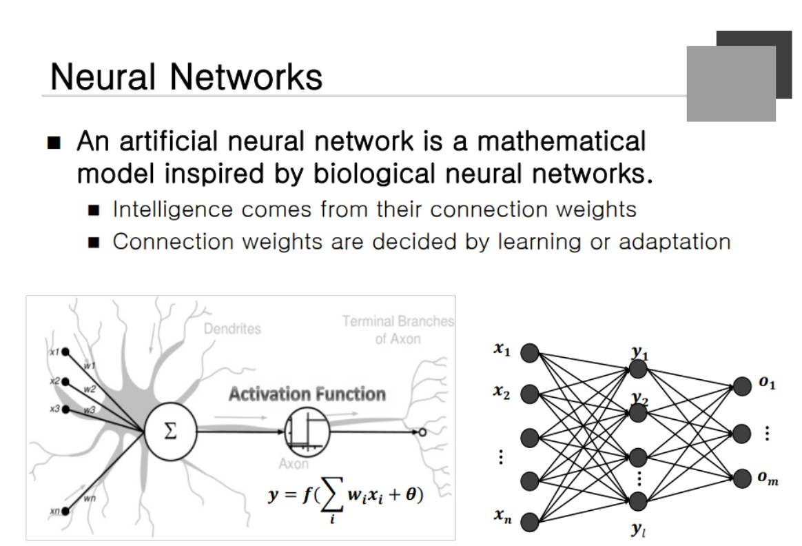
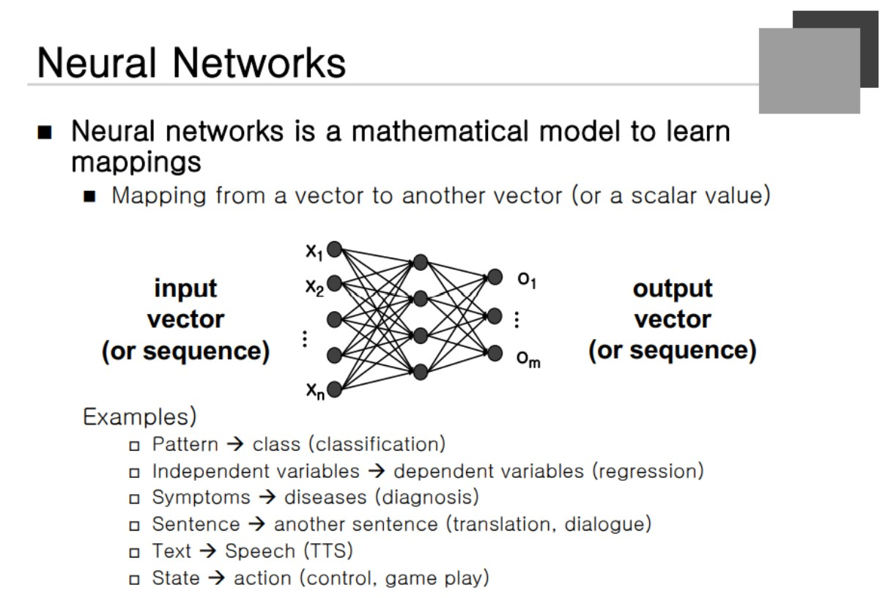
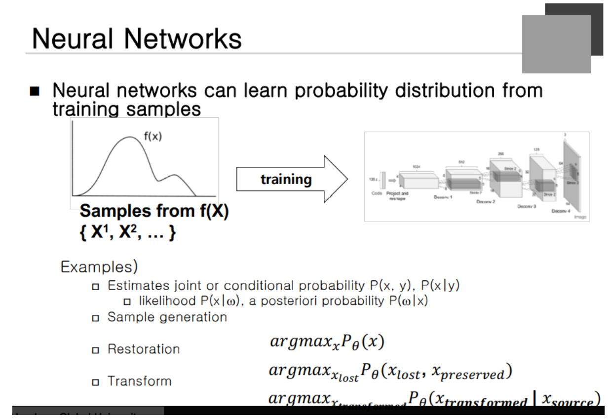
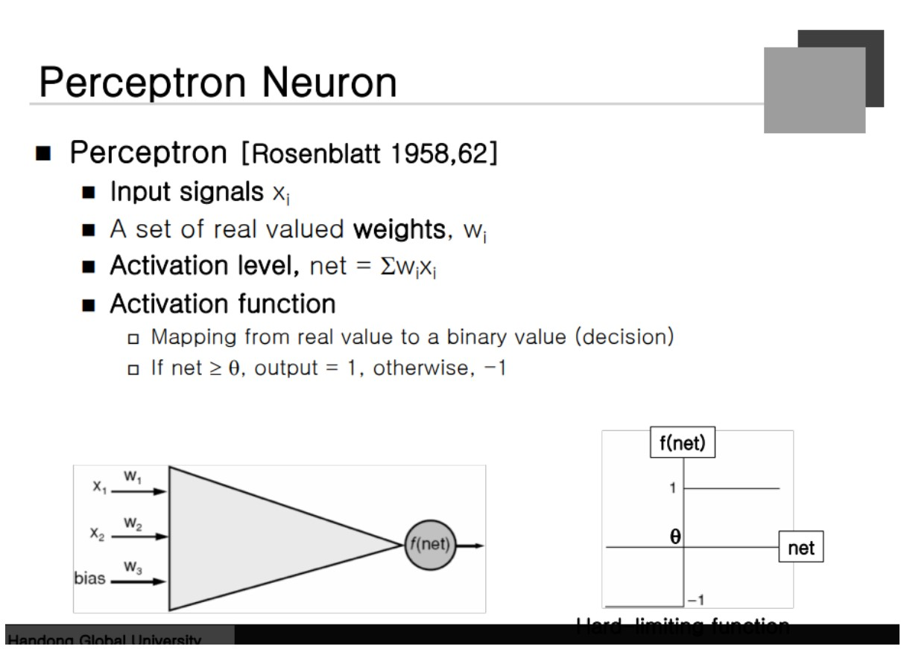

### Neural Network
생물학적인 뇌세포를 모방해서 만든 Computation Model.  앞 쪽에서 신호를 받아서 Merge하고 일정 수치 이상이면 다음으로 넘기는 역할로 알려져 있다.

사람의 뇌는 복잡한 일을 할 수 있지만 뉴런 하나의 단위는 굉장히 단순하다는 것. 이런 개념으로 컴퓨팅을 하기 위한 모델링을 시작했다.

Connection Weight을 곱해서 각 데이터를 더해서 Merge해주고 Activation Function 을 통해서 함수가 만들어진다. 모든 값이 시그마로 인해 더해지고 (세타)라는 값을 더하게 된다. 이 (세타)의 경우 직선의 방정식 **y = ax + b에서 b가 있어야 모든 직선이 표현되듯** Bias를 (세타)로 더하게 되는 것이다.

뉴런 하나가 하는 것을 weighted sum의 형태로 Merge하는 것, 입력 정보를 Merge해서 좀 더 High Level 로 바꾸는 역할을 한다.

Nearal Network에서 가장 중요한 것은 weight를 얼마로 해야하는 지가 중요하다. 이렇게 생긴 뉴런이 여러개를 구성하면서 여러개의 Layer가 구성되고 이렇게 하나의 Network가 구성된다.

Weight라는 것은 노드와 노드를 연결하는 집합체가 된다. Neural Network가 어떤 일을 배웠다라는 것은 그 Task를 수행하면서 가장 최적의 weight를 찾았다라는 것이다. 무엇인가를 배웠다라고 할 때 Knowledge가 weight에 저장된다고 할 수 있다. Connection Weight은 Training data에 의해서 자동으로 최적화 할 수 있다.

### Neural Network
Parameter에 해당하는 것이 Weight와 Bias 두 가지 종류의 숫자가 Behavior를 결정할 수 있는 파라미터가 된다.

### Learning Mapping

input vector가 들어왔을 때 그에 대응하는 output vector를 낼 수 있도록 학습을 한다. 세상에 존재하는 많은 문제가 벡터에서 벡터로 Mapping하는 것으로 표현할 수 있다. **어떤 물체를 식별했을 때 맞추는 문제도 벡터로 표현 할 수 있다.** 입력 변수가 들어왔을 때 출력 벡터로 얻게 되는 것도 다 가능하다.

최근에는 Sequence에서 Sequence로 이동하는 것까지 구현이 된다. 하지만 Sequence는 길이가 고정되어 있지 않다. 
 
전통적인 방법은 Vector에서 Vector로 Mapping을 했지만 **요즘은 Seq에서 Seq로 연결**까지 진행하고 있다. 어떤 Text가 들어왔을 때 음성신호로 바꾸면 TTS가 되고 반대의 경우 ASR이 된다. 이도 마찬가지로 Mapping의 문제이다.

### Learn Probability distribution

Neural Network한테 사람의 얼굴을 보여주고 사람을 만들어라 하며 비슷한 패턴의 사람을 만들어낼 수 있다는 것이다. 사람 얼굴이 가지고 있는 확률 분포를 자신이 학습한다는 것이다. 그러한 **확률 분포에 입각해서 새로운 output을 만들어내는 것이 Neural Network의 역할**이라고 할 수 있다. 확률분포를 학습했을 떄 할 수 있는 것들이 있다.

### Sample generation과 Restoration

왼쪽 눈을 보여주고 나머지를 그리라고 했을 때 복구할 수 있다는 것이다. Transformation, 흑백 영상을 주고 칼라 영상을 만들어라라고 하는 것.
학습 없이 하라는 것은 불가능 하지만 많은 영상을 보여주고 나서 많은 확률 분포에 입각하여 Output을 내게 되는 것이다.

### Perceptron Neuron

여러 개의 입력의 weight를 곱해서 Summation을 한다. Activation function의 경우 +1 -1 0 의 표현 방식을 가진 네트워크이다. Weighted Sum이라는 것으로 표현이 되는데 수학적으로 봤을 때 **Linear한 상태이다. 즉, 단순한 모델링밖에 풀 수 없다는 것**이다. 

**복잡한 문제를 해결하는 방법은 Layor를 많이 쌓는 것이다.** 만약 Layor가 두 개 이상이 있다고 생각해보자. 

Weighted Sum이 계속 싸이고 그것을 수학적으로 정의한다면 여전히 Linear하게 된다. layor가 많은 Network를 쓴다면 여전히 Linear한 상태가 되고 여전히 효과가 없다는 것이다. 그래서 Nonlinear 방법을 사용해야 한다.