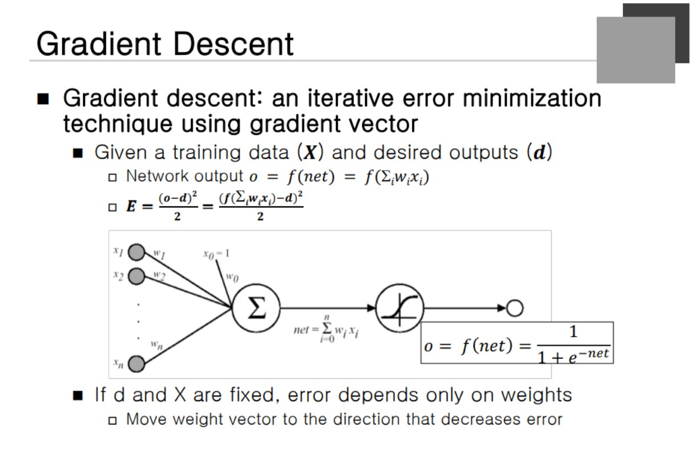

### Activation Function

우선 **Non Linear**한 방법을 사용할 수 있다. 확률값을 고려해보면 -1 에서 1까지의 값을 가진다.  Measurement로 나온 것을 확률과 Decision으로 하기 위해서 필요하다.

### Forward Propagation 

첫 번째 Layer의 Input Vector는 단순히 입력정보가 되고 두 번째 Layer부터는 각각 해당 Operation 함수를 거친 값들을 가진다. **다음 번의 node들도 이전의 값들로 부터 Operation이 축적되어 여러 Layer를 거쳐 전파되는 것을 Propagation**이라고 한다.

Node와 Connection Weight이 존재한다는 것이다.
**InDim** : Input Layer 
**outDim** : ouput layer
connection weight라는 것은 vector가 아니라 matrix처럼 전달이 되어야 한다. 

C언어로 프로그램을 짤 때 2차원으로 할 수 있지만 1차원으로 쭉 표현했다고 가정함. bias 는 output값마다 갖고 있는 수직상의 벡터라고 할 수 있다. output 역시 벡터의 형태로 표현할 수 있다.

for 문을 통해서 Summation 을 해주게 된다. Activation function을 통과시키기 전의 값을 **Net value**라고 한다. 즉 순값이라고 한다. Net 값을 계산하기 위해서!!!

inweight의 시작점은 weight부터 사각형의 넓이를 더한 것 만큼부터가 된다. 해당 Net 값을 더할 때 for문을 이용해서 input과 weight를 곱해서 더하게 된다. 마지막으로 bias의 값을 더하게 된다.

ReLU function을 사용한다. net value를 취하고 0과 net중에 더 큰 값을 내면 output이 만들어진다라고 할 수 있다.

### Building Neural Network Recognizer

입력 패턴을 **Feature Extraction**을 통해 바꾸서 해당 C 코드를 적용시키면 두번 재 Layer나오고 다시 과정을 거쳐서 Output을 통하면 학습을 할 수 있다.

### Single Layer Perceptron

input node가 두 개이고 Bias 가 없다고 가정해보자. 그렇다면 오른쪽 함수처럼 표현이 된다.  그리고 또 하나의 Rule을 만들어보쟈. 양수이면 class1, 음수이면 class2 라고 가정을 한다.

X1이라는 class 1에 대해 (2,1)이 들어오고 Class 2에 대하 (1,2)가 들어온다. 이는 Training data에 대한 학습이다. 이런 값이 나오도록 w1과 w2를 결정하면 된다. 만약 확률이 0가 되면 어떻게 되는가???

이는 Feature space의 경계선이 된다.

### Decision Boundary of Perceptron

하나의 직선이 표현되고 Class1과 Class2의 경계에 해당하는 것이 **직선의 형태**로 표현되고 있다.

### Training of Single Layer Perceptron

첫 번째 Layer를 Input Layer라고 부르고 두 번 째 Layer는 output Layor라고 부르게 된다. 학습하기 위해서 그 문제를 풀기 위해서 **최적의 weight를 찾는 과정**이 된다.

무엇인가 주어져야 하는데 그 전에 Network Structure가 정의되어야 한다. Layer의 초기값이 주어져야 한다. 초기에 **랜덤**하게 weight이 주어지고 Error를 줄여나가야 한다.

Desired Output이 함께 주어진다. 

### Perceptron Training Algorithm
Continuous perceptron training

### Gradient Descent

**Error function 출력 패턴과 Desired output의 차이를 Error**라고 한다.
a: 실제 출력값, d: 원하는 출력값 

부호를 생각해서 제곱을 하고 1/2를 곱하게 된다. (수학적 Tric) 분자를 제곱했고 이를 미분하면 2가 생기기 때문에 2로 나눈 것.

wx 를 시그마를 통해 다 더해지고 E를 구하게 된다. Training을 할 때 x와 d는 고정되어 있다. 
