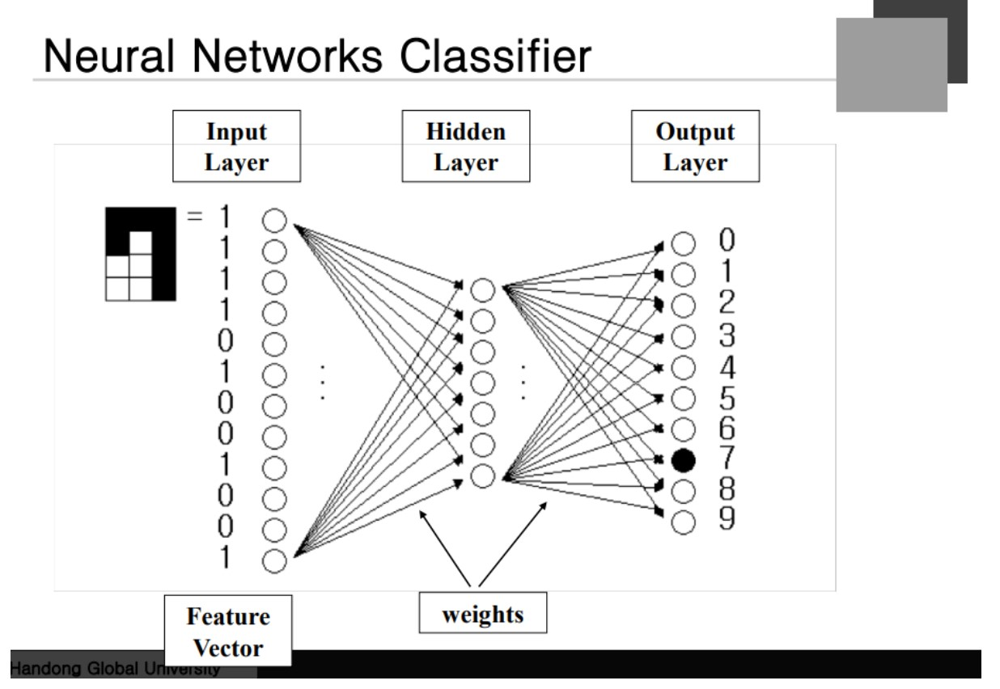

### Gradient Descent
**미분을 통해서 Optimize**하게 된다. 하나의 스칼라 값을 W에 대해 미분을 하게 된다. W의 값을 일렬로 세워서 일차원 벡터인 것으로 생각하자.

scalar 값을 나열하면 다음과 같은 식을 얻을 수 있다. (가장 오른쪽 식) 이러한 벡터를 Gradient 벡터라고 한다.

각각 Element들이 해당 Weight로 미분이 된것이 Gradient 벡터라고 한다. **수학적으로 Error surface의 error가 급격하게 변화는 방향**이라고 볼 수 있다.

W에 Gradient를 마이너스 한다는 것은 반대 방향으로 간다는 것을 의미한다. 감소하는 방향으로 이동하게 된다. **현재 Weight에서 Gradient를 빼주는 것이 Gradient Minimize pattern이라고 한다.** 미분을 해서 Gradient Vector를 찾았지만 얼마나 가야 하는지도 계산을 해야 한다.

어떤 숫자를 곱하게 되는데 **Learning Rate**라고 하는데 해당 방향으로 얼마나 이동할 것인가를 결정하게 된다.

**랜덤**이라는 위치에서 W가 시작되고 미분을 통해서 Gradient를 구하게 되고 이동을 한다. 그리고 이동한 위치에서 다시 Gradient를 구하게 되고 MInimize를 반복한다.

Gradient를 어떻게 구할 것인가???

### Chain Rule

**대부분의 Gradinet를 구하는 식은 Chain Rule에 의해서 계산된다.** 변수가 3개가 있다고 가정하자. y는 x의 functiion z는 y의 function이라고 하자

여기서 z를 x에 대해서 미분을 하고 싶은 경우...!! 다음과 같은 방법을 진행한다. 각각의 변수를 Layer라고 봐도 무방할 것.

### Gradient Descent

W에 Gradient를 구하고 learning rate를 곱해서 Gradient minimize를 하게 된다. Error는 output의 function이다. Error를 output에 대해 미분하는 것은 그냥 할 수 있다. 즉, Error을 output에 대해 미분하면 real output - expected output이 된다. = o - d 가 된다라는 것.

o를 net으로 미분,, net은 activate function에 들어가기 전의 값. 결국 Activate Fucntion의 도함수가 나온다. net을 Weight에 대해 미분을 진행!!
 

시그마 wx를 w에 대해 미분을 하게 되면 x가 나온다. 학습식은 다음과 같이 나오게 된다. ==> "Update rule"

### Learning Rate

너무 커도 안돼고 너무 작아도 안된다. 너무 작으면 한 번에 아주 조금씩 가므로 error가 조금씩 줄어든다. 즉 수렴이 느려진다. Local Minimun에 갇힐 수 있는 문제가 발생한다.

Learning Rate가 많아지면 빠르게 수렴하는 것이 아니라 천천히 수렴한다. 오히려 Error가 커지는 문제가 발생할 수도 있다.