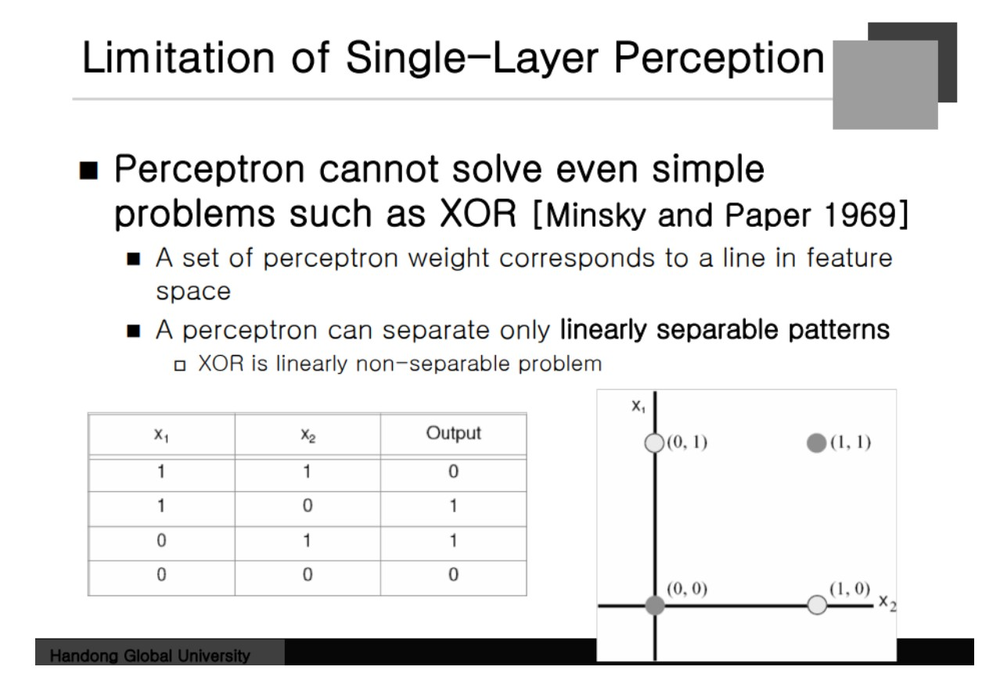
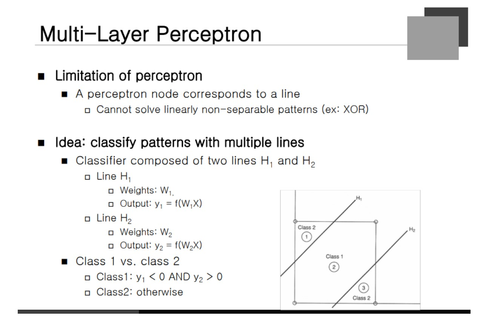
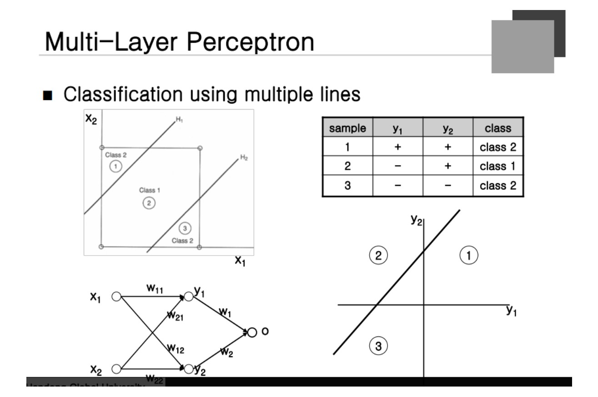
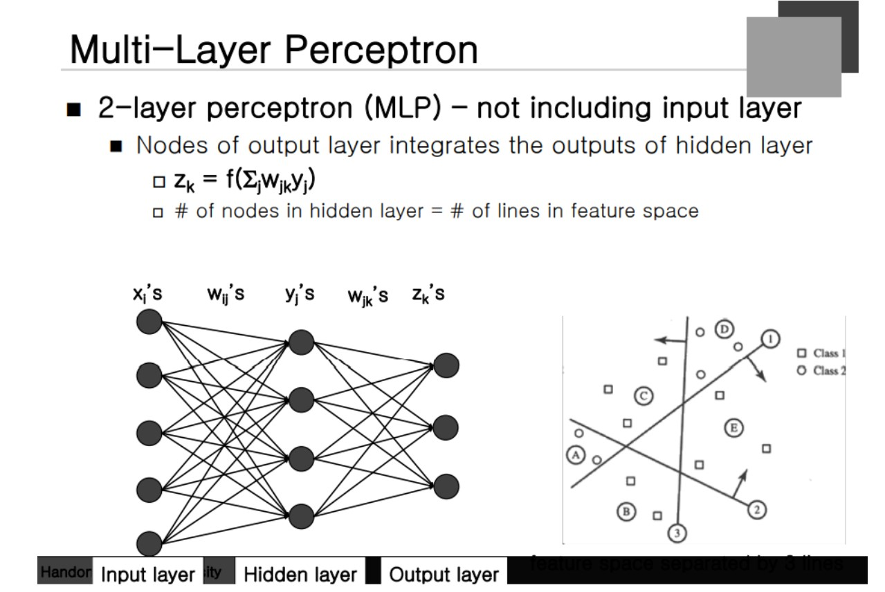

### Limitation of Single-Layer Perception
**XOR 문제** 
11 이나 00 이 들어가면 0이 나오고 01 이나 10 이 들어가면 1이 나와야 한다.

Neural Network가 이 경계선을 잘 만들 수 있어야 한다. 즉 직선으로 구분될 수 있는 문제여야 한다. output이 0과 1을 내는 class가 2개 존재한다.  하지만 이 문제는 직선 하나를 가지고 Classification 문제를 풀 수 없다.

즉, **XOR 문제도 해결을 하지 못함**으로 Single Layer의 문제점이 발견되었다.
 

### Multi Layer Perceptron

직선 2 개 H1 과 H2가 존재한다고 가정해보자. 각각의 직선은 Perceptron을 통해서 표현할 수 있다.

y1과 y2를 각각의 직선 보다 위에 있고 아래에 있고를 표현해주는 변수라고 할 수 있다.

### Multi Layer Perceptron

y1도 양수 y2도 양수가 되는 패턴
y1이 음수 y2는 양수가 되는 패턴
y1도 음수 y2도 음수가 되는 패턴 이 존재한다.
여기서 **좌표계를 변환**한다. y에 대한 좌표계로 변경하게 된다. + + 가 나온 것은 1사분면 - + 는 2사분면 - - 는 제 3사분면으로 구분하게 된다. 이렇게 좌표계로 변환하면 적당한 한 직선을 구한다면 해당 Class를 구분할 수 있다는 것이다.

X1과 X2로 만들 수 있는 두 개의 직선을 만들고 Y1와 Y2에 해당하는 좌표를 구하고 Weighted Sum을 구한다면 하나의 직선을 구할 수 있게 된다. 

### Network Depth and Decision Region

볼록 다각형에 대한 Class가 Define될 수 있다는 것. 
**Half Plane**
Convec Region과 Arbitrary에 대한 구분을 할 수 있다는 것이다. 
**Multi Layer Perceptron**
Hidden Layer가 그 사이에 존재하게 된다.