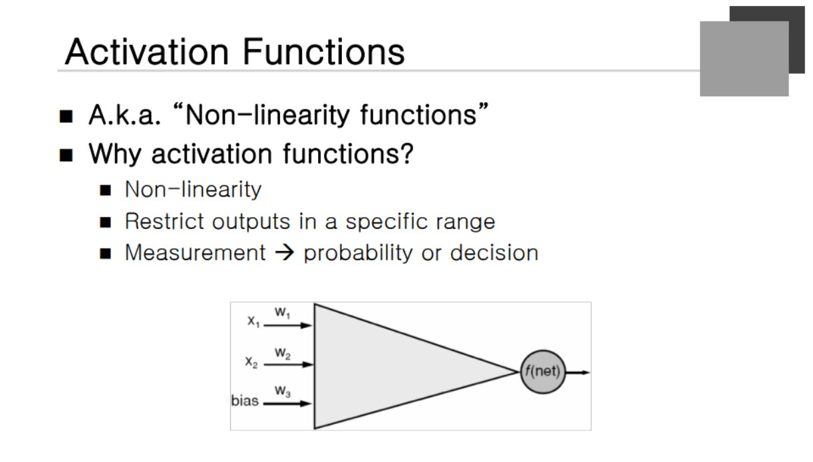
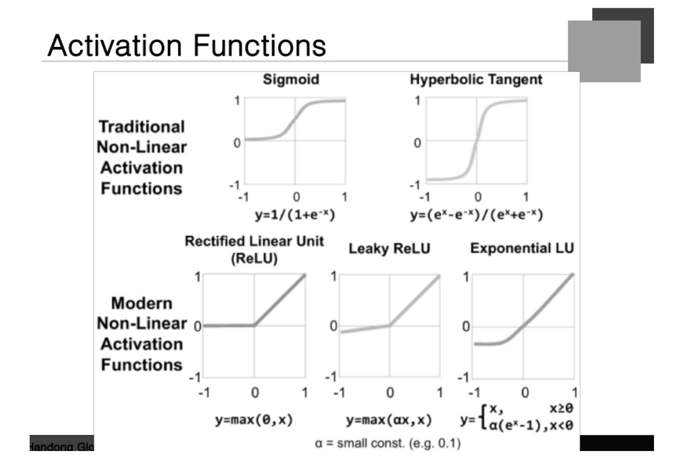
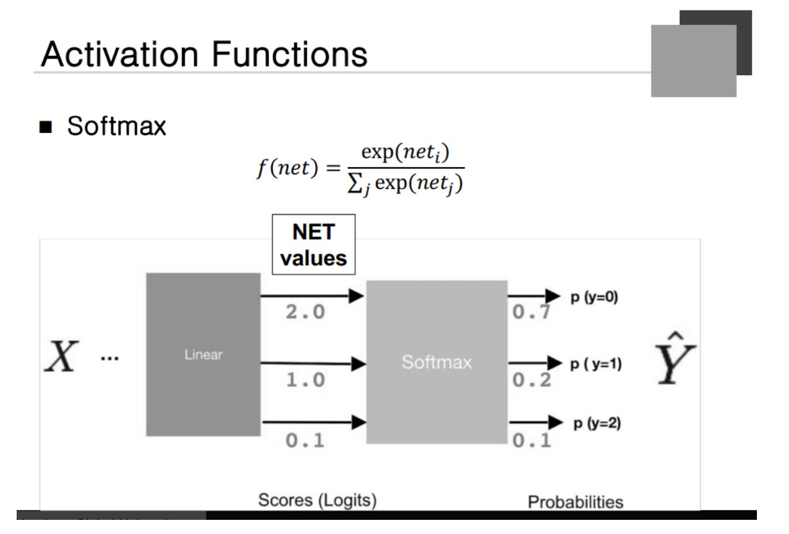
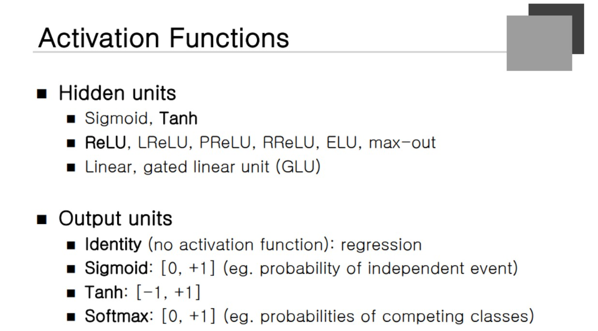

### Activation Function

" Non-linearity Function " 이라고 불린다.
**Weighted sum을 한 번 더 처리해주는 역할**을 한다.

### Activation Functions

**Hyperbolic Tangent 함수** : -1에서 +1까지의 값을 가진다.
**ReLU 함수** : net value와 0 사이의 max값을 취하는 것.

### Softmax function

**여러 개의 카테고리를 나타내는 것을 확률적으로 표현하고 싶을 때** 사용한다. 확률은 0에서 1 사이의 값을 가져야 한다. 하지만 Net Value는 절대로 확률이 안됀다. 그래서 **Exponential을 취해서 전부 양수로 변경**을 하고 모든 node에 대한 Exp 값을 더해서 나누게 된다.

그렇다면 전체 값들은 1보다 큰 값이 나오지 않는다. score 값이 들어왔을 때 Softmax function을 거친다면 확률적 접근이 가능하게 된다. 

### Activation Functions

**Hidden Unit**
- 거의 대부분 ReLU를 사용하고 특정한 경우 LReLU와 PReLU를 사용한다.
- Hyper Tanzent를 많이 사용하는 경우도 있다. recurent networtk를 사용하는 경우에..!!!
- **일반적인 Network에서는 ReLU function을 많이 사용**한다.
 
**Output Unit**
- regression을 하는 경우 activation function을 안하는 경우가 많다.
- identity function을 사용해서 -무한대에서 +무한대의 값으로 세팅할 수 있다.

**Tanh**
- -1에서 +1 사이로 값을 단정하고 싶을 때
Softmax
