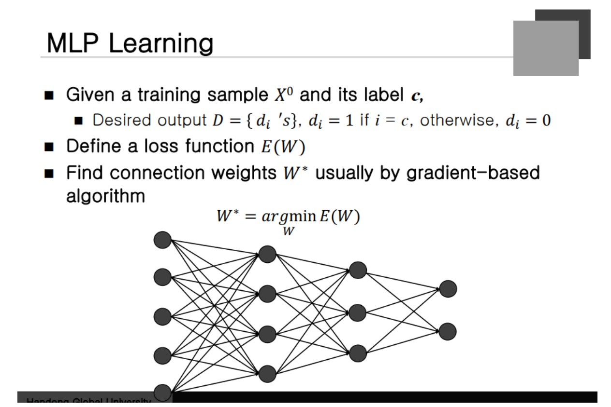
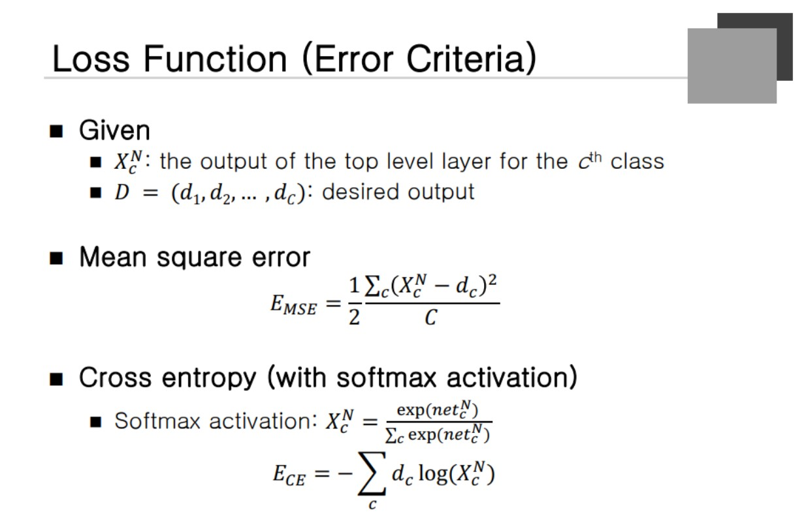
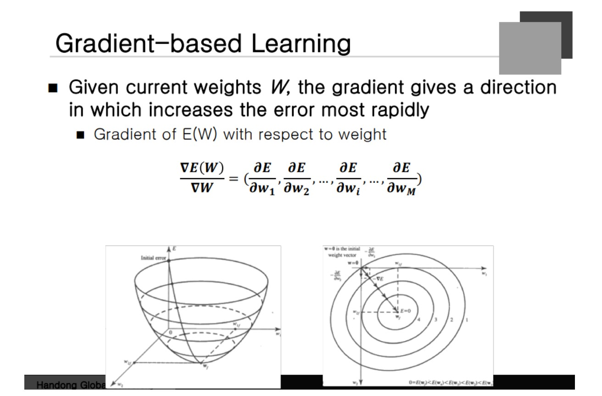
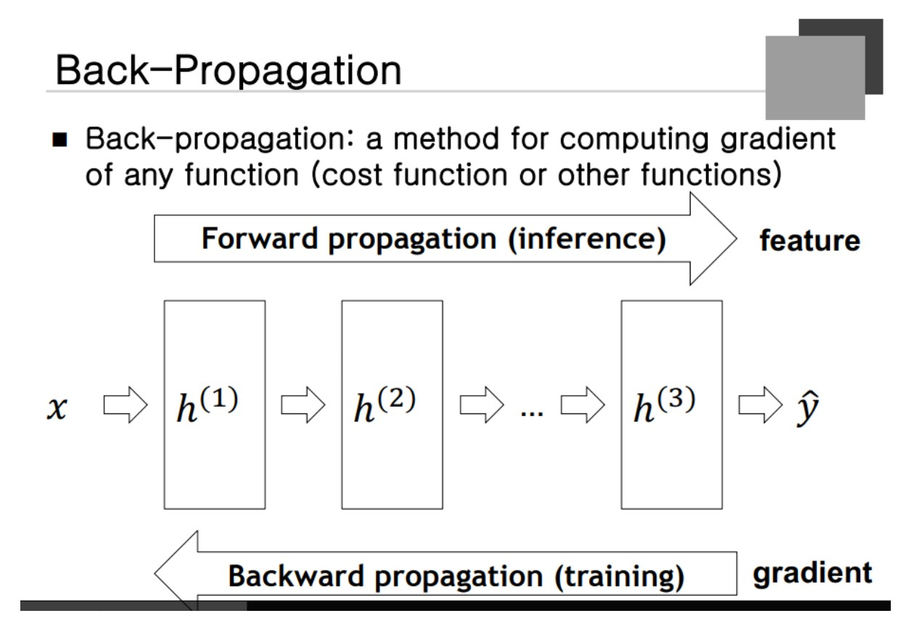
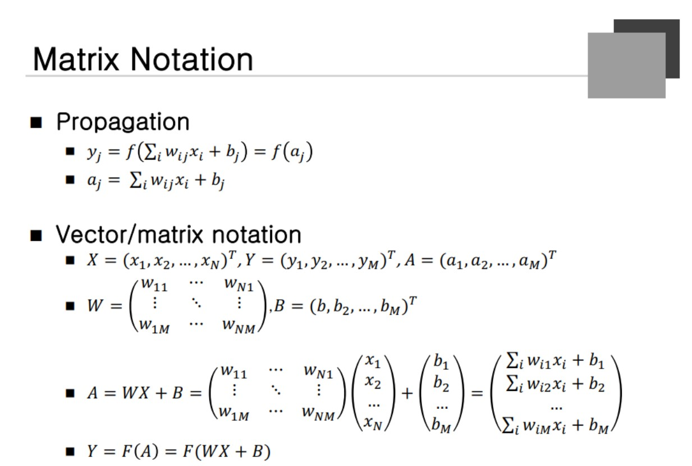
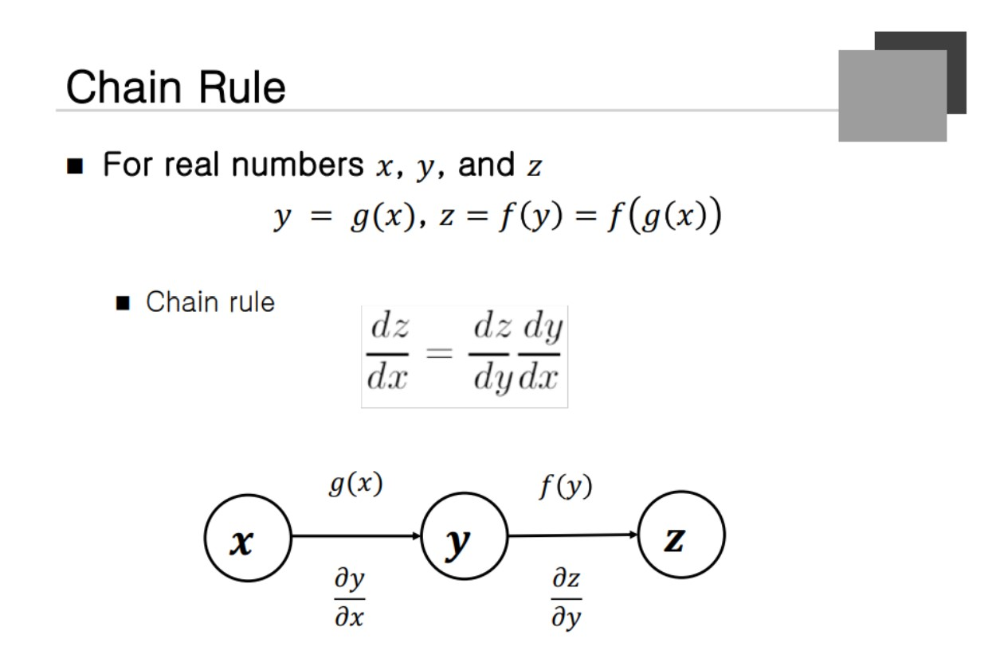
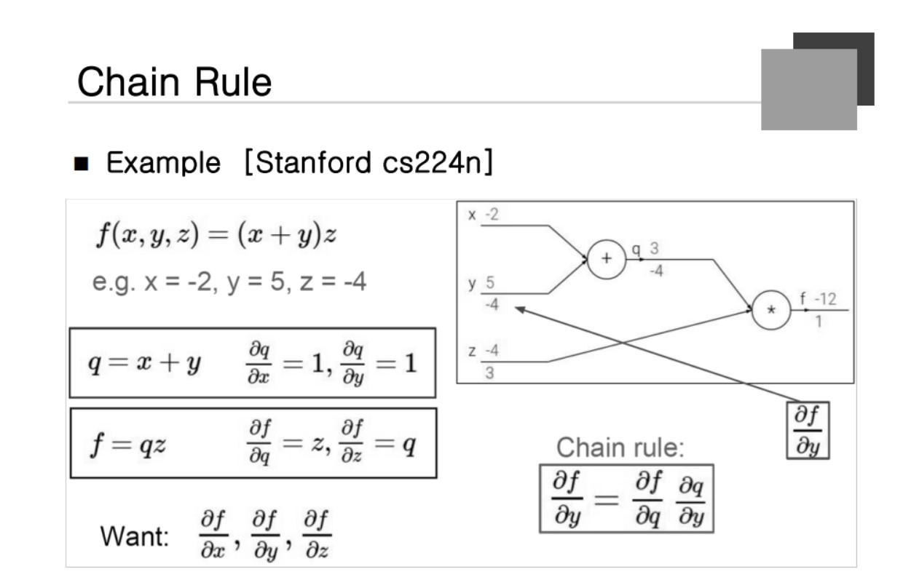
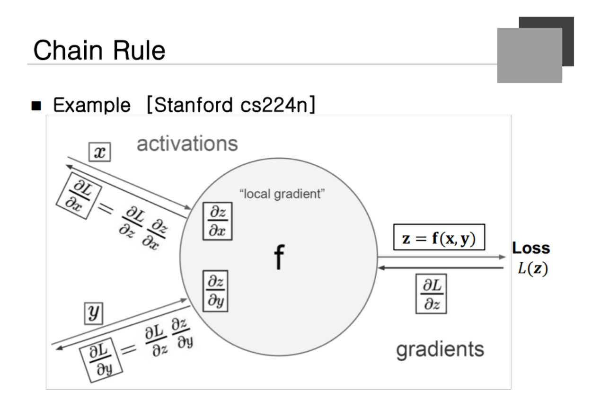
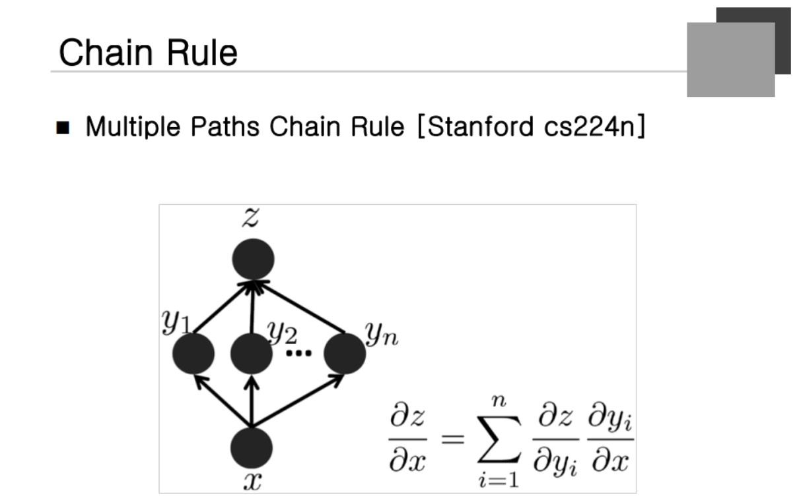
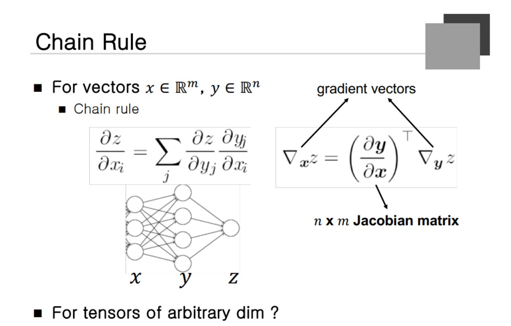

### MLP Learning

Layer 하나를 나타낼 때 x의 super script를 쓰겠다고 가정. X0 는 input vector가 된다. Label에 해당하는 노드는 전부 1
 
loss function은 Desired ouput과 real output 사이의 차이에 해당한다. 일단 시작점은 **랜덤**한 node에서 시작해서 조금씩 gradient를 빼줌으로써 학습을 시작한다.

### Loss Function(Error Criteria)

최종 output Layer에서 desired output 값을 빼고 제곱을 해서 C개에 해당하는 것 만큼 나눠준다. 그러면 Error를 찾을 수 잇고 Mean square를 하게 되는 과정이 된다. **최근에 들어서 Cross entropy function이 많이 사용되고 있다.** Softmax activation과 잘 쓰인다.

Desired output이 나오고 Real Output에 log가 쓰이고 곱하는 식이 된다. X(n)이 D를 예측하는데 얼마나 도움이 되냐를 표현해주는 식

### Gradient-based learning

Weight에 대해 미분을 하고 현재 weight에서 빼주면서 진행을 하게 된다.

### Back-Progation

학습을 할 때 gradient를 구하는데 이는 output에 대해 정의된다라는 것. 그것을 통해 그 이전 것을 계산하게 되는데 이런 알고리즘을 Back Propagation이라고 한다.

### Matrix Notation

y 가 weighted node의 Summation에 대한 값으로 표현하게 된다. 여기선 a를 net value라고 하고 해당 입력을 벡터에 대해서 표현하고자 한다. 복잡했던 notaion이 간단하게 표현이 가능하게 된다.

### Chain Rule

x에서 y, z로 갈때 먼저 z를 y로 미분하고 y를 x 에 대해 미분한 것을 곱해주면 된다.

### Chain Rule

Loss를 Output z에 대해서 미분을 해버린 것으로부터 시작한다. z를 x에 대해 미분한 것과 z를 y에 대해 미분한 것만 있으면 할 수 있다는 것.

**gradient를 받게 되고 자신에게 필요한 gradient를 가질 수 있다는 것이 key point**

### Chain Rule
두 개의 vector의 편미분의 합을 구하면 **각각의 경우**를 구할 수 있다.

일반화시키면 2개 이상인 경우에도 구할 수 있다.

델타에 x를 붙이면 어떤 식을 x에 대해 미분한 값이다라는 뜻.Z를 y에 대해 미분하고 Z를 x에 대해 미분한 것