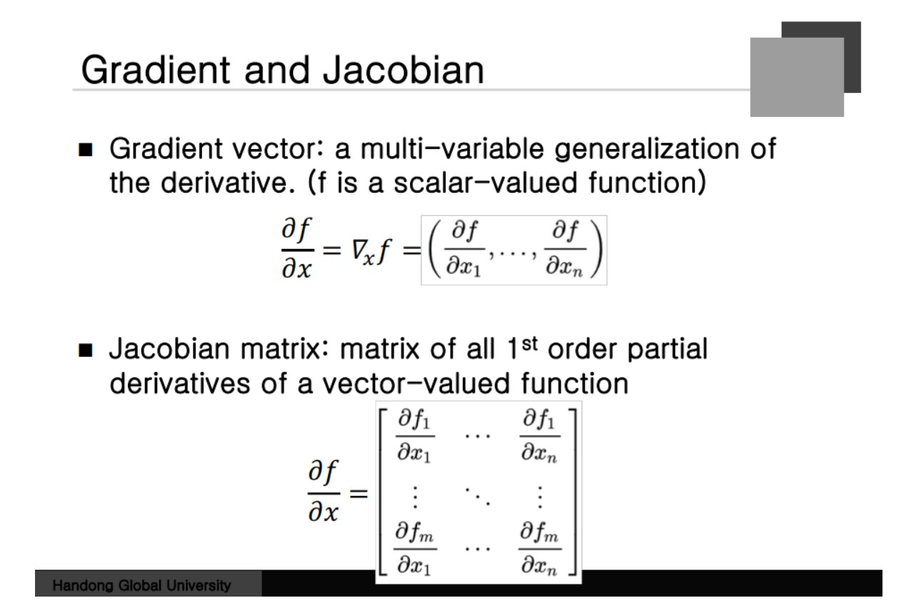
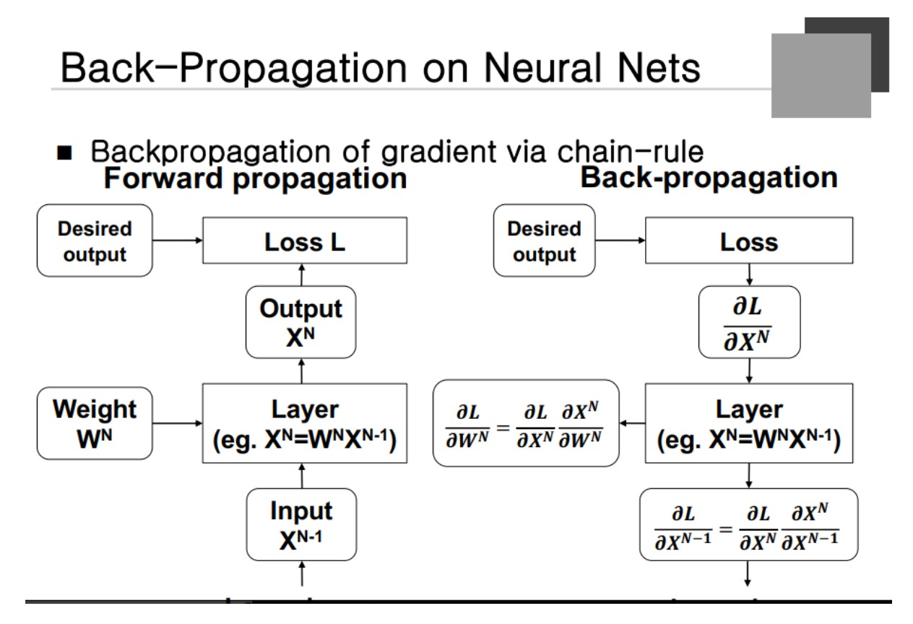
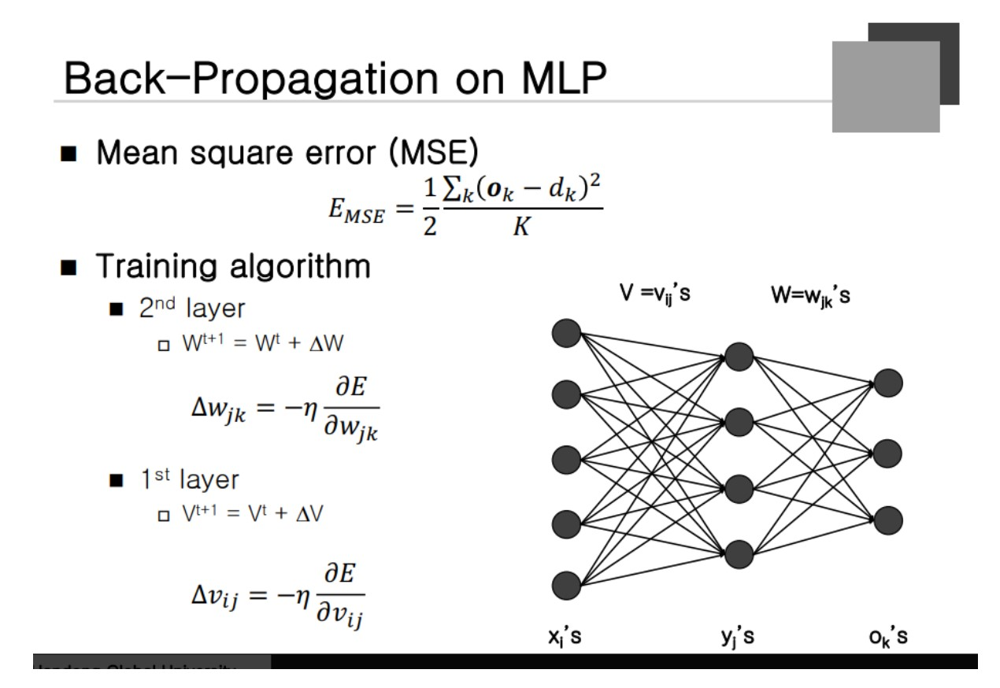
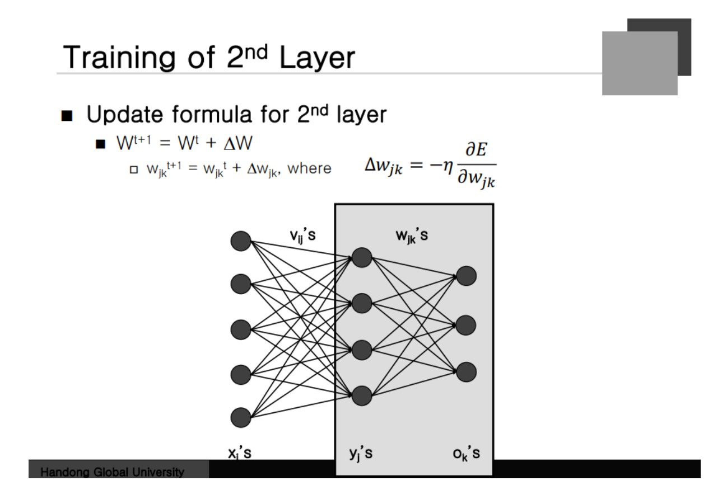
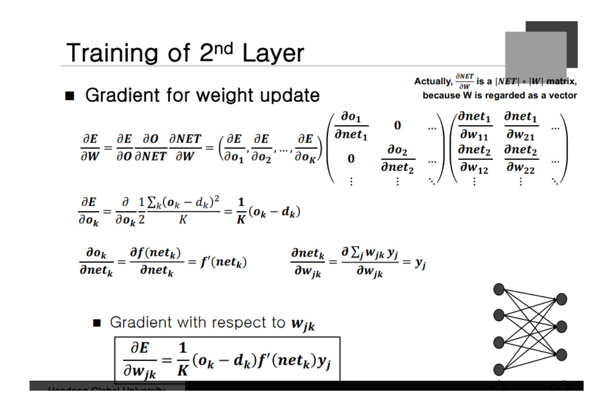
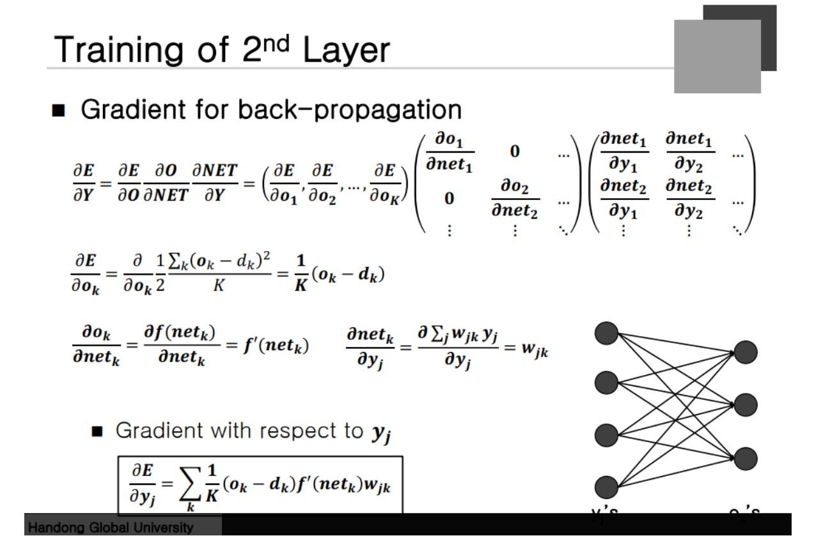
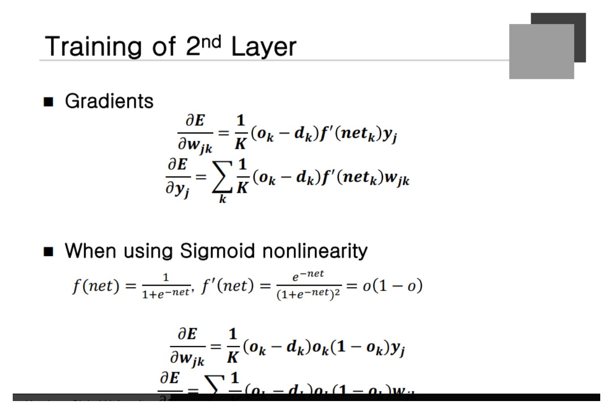
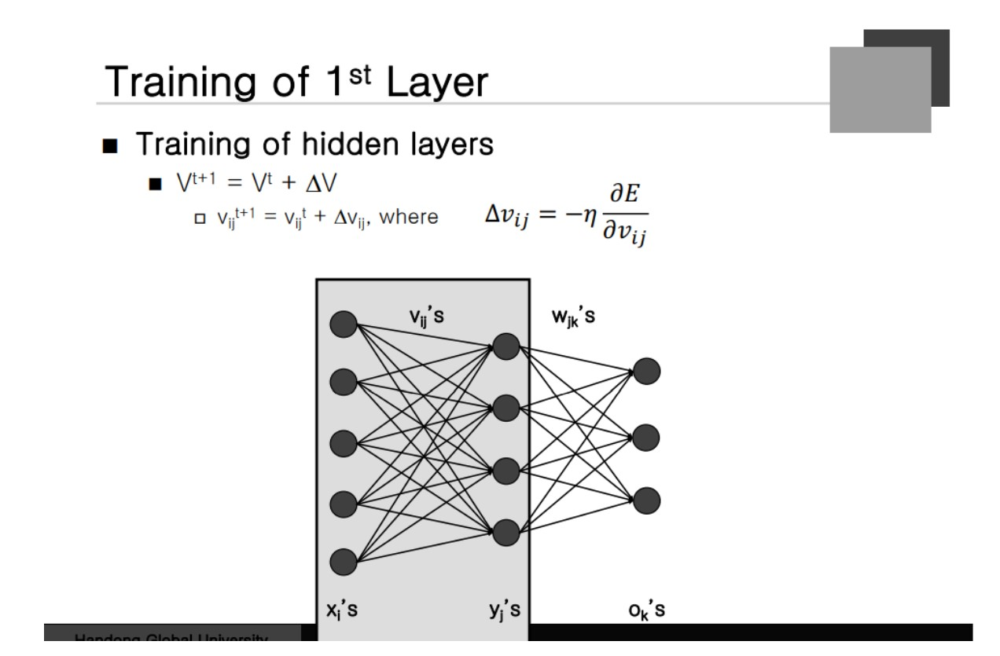
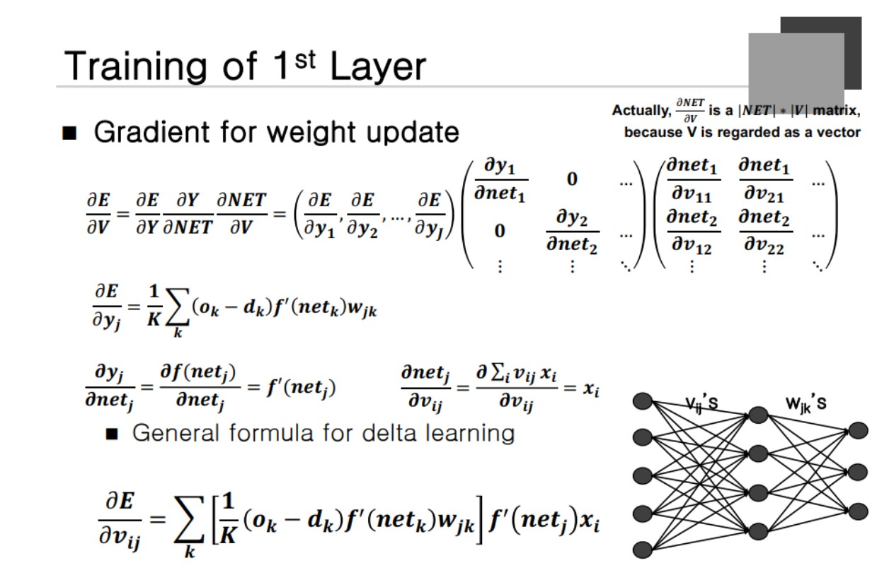

### Gradient and Jacobian
Gradient Vector 스칼라 값을 벡터로 미분하면 얻어지는 것. Error function을 벡터로 미분하면 Gradient를 얻는다.

**벡터를 벡터로 미분하는 경우** Matrix 형태로 나타나게 되는데 그것을 Jacobian Matrix 라고 한다.

**output의 개수와 Input의 개수로의 행열로 이루어진 Matrix**가 된다. 벡터끼리의 Chain rule은 Matrix의 형태로 나타난다고 볼 수 있다. **출력값에 대한 Gradient에 Jacobian 행렬을 곱하면 Input값에 대한 Gradient가 나온다.**

### Back-Propagation on NEaral Nets
 
밑의 layer에서 벡터가 올라오면 Weighted Sum을 해서 Output을 내주게 되는데 Desired Ouput과의 Loss 를 구하게 된다. **학습의 경우 Loss Function을 Output Function에 대해서 미분을** 하게 된다.  두 가지의 경우를 계산하게 되는 데 Loss 를 Weight로 미분한 Gradient가 첫 번째인데, 이것이 필요한 이유는 **Weight을 업데이트**할 떄 직접적으로 사용되는 값이다. 다른 하나는 Loss를 X의 N-1 에 대한 Gradient를 계산해야 한다. 이것은 **밑의 Layer가 학습하기 위해 계산을 해줘야 하는 것**이다. 

Output Layer에 대한 Loss 가 직접적으로 계산이 안되기 때문에 입력에 대한 Gradient를 만들어주고 마치 밑의 Layer의 출력 Gradient를 구하는 결과와 비슷하게 보인다.

출력 Gradient를 받아서 Weight에 대한 Gradient를 계산하고 자기 Weight에 대한 것을 확인한다. 출력 Gradient로 부터 입력 Gradient를 계산해서 밑의 Layer에 넘겨주게 되고 동일한 절차로 자신의 Node의 Weight의 Gardient를 계산하는 절차가 진행된다. 이렇게 학습이 반복되며 이 과정을 **Back Propagation**이라고 한다. 

Loss 를 Weight에 대해 미분할 때 먼저 Loss를 X에 대해 미분하고 X를 Weight에 대해 미분해서 곱하게 된다. 내려올 경우 Loss를 입력으로 미분할 경우 Loss를 입력으로 미분하고 Output을 X에 대해 미분하게 된다.

### Back-Propagation on MLP

Loss function은 MSE Function을 이용한다고 가정(미분이 쉬움) Training Algorithm은 먼저 Gradient를 계산을 한다. Gradient Descent에 대한 일반 식.
W: 두 번째 Layer의 Weight V: 첫 번째 Layer의 Weight

### Training of 2nd Layer

먼저 뒤쪽 Gardient 계산이 필요하다.

### Training of 2nd Layer
 
**먼저 Error를 Output에 대해 미분하고  Output을 Net Value에 대해 미분하고 Net Value를 Weight에 대해 미분한다.**

W가 Matrix인 경우 미분이 잘 안돼기 때문에 **W를 일렬로 나열해서 미분을 하겠다**라는 것이 된다. Output을 Net 에 대해 미분한 Jacobin Matrix를 생각해보자. 이는 **Diagonal Matrix**밖에 남지 않는다. Diagonal이 아닌 Matirx에 대한 미분값은 다 0이 나오게 된다. 도함수는 Diagonal matrix가 된다는 것이다.

마지막으로 Net 을 Weight에 대해 미분한 것 -> Row의 계수는 output 개수 column의 개수는 input의 개수가 된다. 이를 수식으로 나타내면 아래와 같은 수식을 얻을 수 있다.

### Gradient for Back-propagation

Error를 Y 로 미분한 것이 필요하다. Net Value를 Y에 대해 미분한다는 것이 이전과 다른 점이 된다. Net을 Y로 미분하면 W가 나온다는 것. 

### Training of 2nd-Layor

Error를 W로 미분하는 것은 자신의 Node를 학습할 때 사용. Error를 Y로 미분하는 것은 다음 Layer로 전달할 때 필요. 이렇게 하면 두 번째 Layer에 대한 학습이 완료되는 것이다.

### Training of 1st Layer

첫 번째 Layer의 학습을 어떻게 하는가? Error를 V로 미분해야 한다. 

Error를 y로 미분한 벡터는 아까 계산을 했었다. Error을 output으로 미분한 벡터를 Back Propagtion을 하므로써 Y를 계산했다. 우선 Y로 계산한 것들은 가지고 있다고 가정을 할 수 있게 된다. **Y에 대한 Gradient는 Back Propagtion을 통해서 건너 받은 벡터**가 된다. 

Diagonal Matrix 부분에는 **Net Value에 대한 Y의 도함수**가 된다. Net의 V에 대한 미분 행렬의 경우 아까와 비슷하다. **Error를 Y에 대해 미분하면 앞의 경우에서 구한 수식을 가져다가 사용하면 된다.**

