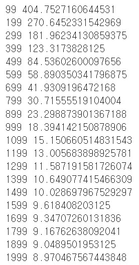

# nn.Module 이해하기

    import torch
    import math

    x = torch.linspace(-math.pi, math.pi, 2000)
    y = torch.sin(x)

### sin 함수모형을 예측하기 위해 (-파이,+파이)의 값을 가지는 2000개의 데이터를 활용한다.

### 단순히 Autograd 함수를 통해서 모델과 손실함수를 정의하는 것이 아니라 nn.Module 을 통해서 사용자 정의 모델 및 손실함수(loss function)을 구현하는 것이 KeyPoint.

----

    p = torch.tensor([1, 2, 3])
    xx = x.unsqueeze(-1).pow(p)

### xx를 만드는 과정에서 BroadCasting의 개념이 활용되었고 이는 Pytorch Tensor에서 제공하는 자동 Shape 변환 툴로 이해하면 된다.
----
    model = torch.nn.Sequential(
        torch.nn.Linear(3, 1),
        torch.nn.Flatten(0, 1)
    )

### nn.Sequential 함수에서 Linear Function을 사용해서 입력으로부터 출력을 계산하고 내부 Tensor에 가중치와 편향을 저장하게 된다.

### Flatten Fuction을 통해서 예상 출력값인 y의 shape와 동일하도록 1D Tensor로 펴는 과정을 거친다.
---

### MSE(Mean Square Error) 함수를 이용해서 손실을 계산한다. 그리고 learning_rate는 6/10^6으로 설정하고 학습을 진행한다.

    loss_fn = torch.nn.MSELoss(reduction='sum')

    learning_rate = 1e-6
    for t in range(2000):
----
### y_pred에 위에서 만든 모델을 이용해서 출력 데이터의 Tensor를 만들게 된다.

        y_pred = model(xx)
----
### MSE loss function을 이용해서 loss Tensor를 반환한다.

        loss = loss_fn(y_pred, y)
        if t % 100 == 99:
            print(t, loss.item())
----
### 역전파를 위해서 0으로 초기화를 하고 backward 함수를 통해서 loss에 대한 각 Tensor의 계산을 시킨다. 즉, 학습 가능한 모델의 모든 Tensor를 초기화시킨다.

        model.zero_grad()

        loss.backward()
----
### 각 Parameter에 접근해서 learning_rate를 이용한 loss 최신화를 진행한다.

        with torch.no_grad():
            for param in model.parameters():
                param -= learning_rate * param.grad
----
    linear_layer = model[0]

    print(f'Result: y = {linear_layer.bias.item()} + {linear_layer.weight[:, 0].item()} x + {linear_layer.weight[:, 1].item()} x^2 + {linear_layer.weight[:, 2].item()} x^3')

### 결과값

