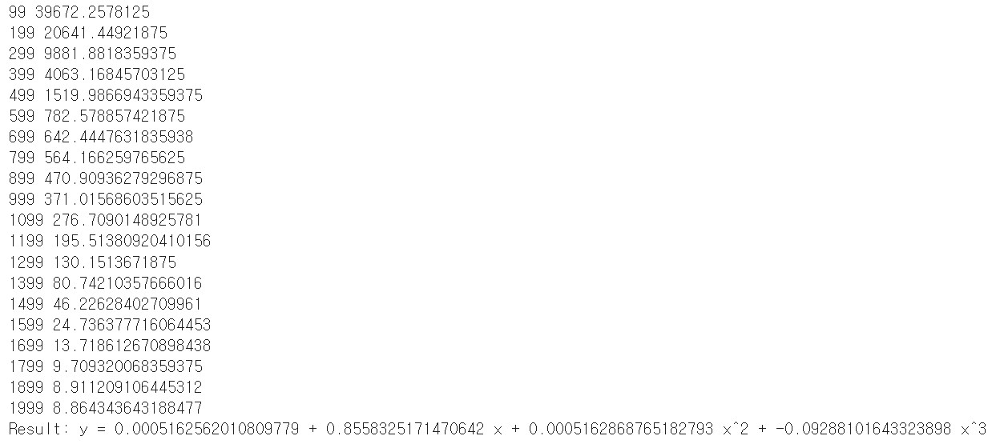

# 사용자 정의 Optimizer 선언

### nn.Module이랑 같은 구조이므로 생략

    import torch
    import math

    x = torch.linspace(-math.pi, math.pi, 2000)
    y = torch.sin(x)

    p = torch.tensor([1, 2, 3])
    xx = x.unsqueeze(-1).pow(p)

    model = torch.nn.Sequential(
        torch.nn.Linear(3, 1),
        torch.nn.Flatten(0, 1)
    )
    loss_fn = torch.nn.MSELoss(reduction='sum')
----

### RMSProp이라는 Optimizer를 사용할 예정

### nn.Module의 경우 각 Param에 접근하는 for문을 이용해서 가중치를 최신화 했다면 이번에는 Optim 패키지를 이용해서 자동 계산이 되도록 한다.

    learning_rate = 1e-3
    optimizer = torch.optim.RMSprop(model.parameters(), lr=learning_rate)
    for t in range(2000):
        y_pred = model(xx)

        loss = loss_fn(y_pred, y)
        if t % 100 == 99:
            print(t, loss.item())

        optimizer.zero_grad()

        loss.backward()

        optimizer.step()

    linear_layer = model[0]
    print(f'Result: y = {linear_layer.bias.item()} + {linear_layer.weight[:, 0].item()} x + {linear_layer.weight[:, 1].item()} x^2 + {linear_layer.weight[:, 2].item()} x^3')

### 결과값

