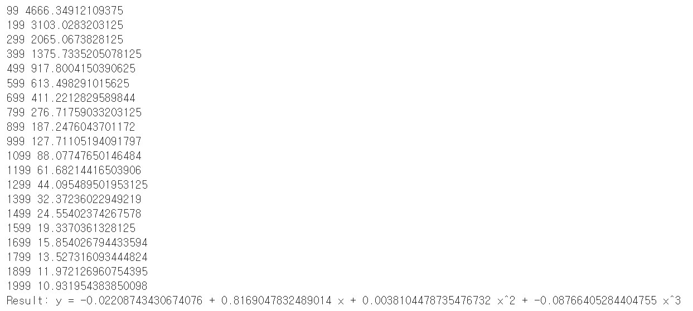

# 사용자 정의 nn.Module 정의하기

    import torch
    import math

----

### 3차 선형 방정식으로 Module을 선언하기 위해서 4가지 변수가 필요하고 이를 Random 초기화를 한다.
    class Polynomial3(torch.nn.Module):

        def __init__(self):
            super().__init__()
            self.a = torch.nn.Parameter(torch.randn(()))
            self.b = torch.nn.Parameter(torch.randn(()))
            self.c = torch.nn.Parameter(torch.randn(()))
            self.d = torch.nn.Parameter(torch.randn(()))
----

### 입력 Tensor를 x로 받고 이를 만든 모듈의 매개변수의 곱셈으로 반환하는 형식의 Forward Propagation을 진행한다.

        def forward(self, x):
        
            return self.a + self.b * x + self.c * x ** 2 + self.d * x ** 3
----

### 사용자 정의 메소드를 선언하는 과정

        def string(self):
            
            return f'y = {self.a.item()} + {self.b.item()} x + {self.c.item()} x^2 + {self.d.item()} x^3'

----

### 위에서 정의한 Model로 선언을 한다.

    x = torch.linspace(-math.pi, math.pi, 2000)
    y = torch.sin(x)

    model = Polynomial3()

    criterion = torch.nn.MSELoss(reduction='sum')

    optimizer = torch.optim.SGD(model.parameters(), lr=1e-6)
----

### Opti 패키지를 사용하지 않으므로 for문을 통해서 각 loss 계산이 된 것 만큼 다시 param의 가중치와 편향을 최신화시켜준다.

    for t in range(2000):
        y_pred = model(x)

        loss = criterion(y_pred, y)
        if t % 100 == 99:
            print(t, loss.item())

        optimizer.zero_grad()
        loss.backward()
        optimizer.step()

    print(f'Result: {model.string()}')

### 결과

