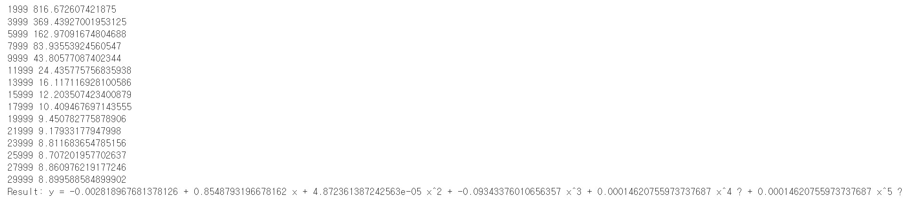

# PyTorch가 동적 그래프에 강력함을  보여주기 위한 이상한 모델 구현

    import random
    import torch
    import math

    class DynamicNet(torch.nn.Module):
        def __init__(self):
        super().__init__()
            self.a = torch.nn.Parameter(torch.randn(()))
            self.b = torch.nn.Parameter(torch.randn(()))
            self.c = torch.nn.Parameter(torch.randn(()))
            self.d = torch.nn.Parameter(torch.randn(()))
            self.e = torch.nn.Parameter(torch.randn(()))
        
----

### 4와 5 중 랜덤한 번호를 입력받아 매개변수 e를 이용해 차수들의 Contribution을 계산하는 Forward 함수를 정의

        def forward(self, x):
            y = self.a + self.b * x + self.c * x ** 2 + self.d * x ** 3
            for exp in range(4, random.randint(4, 6)):
                y = y + self.e * x ** exp
            return y
        
        def string(self):
            return f'y = {self.a.item()} + {self.b.item()} x + {self.c.item()} x^2 + {self.d.item()} x^3 + {self.e.item()} x^4 ? + {self.e.item()} x^5 ?'

    x = torch.linspace(-math.pi, math.pi, 2000)
    y = torch.sin(x)
----
### 위에서 정의한 DynamicNet으로 Model을 정의함

    model = DynamicNet()

    criterion = torch.nn.MSELoss(reduction='sum')

----
### 이 경우 순수 SGD를 사용하면 학습이 힘들기 때문에 Momentum을 활용해서 학습을 진행한다.

    optimizer = torch.optim.SGD(model.parameters(), lr=1e-8, momentum=0.9)
    for t in range(30000):
        y_pred = model(x)

        loss = criterion(y_pred, y)
        if t % 2000 == 1999:
            print(t, loss.item())
        
        optimizer.zero_grad()
        loss.backward()
        optimizer.step()

    print(f'Result: {model.string()}')

### 결과

