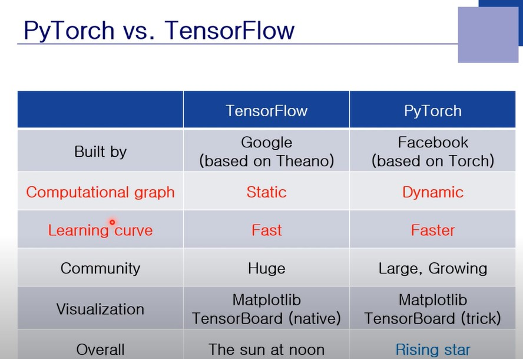

Tensorflow이전에는 쓰기 어려운 라이브러리를 전문가들이 사용했다면 이를 통해 굉장히 쉽게 접근이 가능하게 됐다. PyTorch는 Tensorflow보다 늦게 나왔고 더 쉽게 만들어졌다. 신경망을 시각화하는 TensorBoard는 둘다 사용이 가능한데 약간의 trick을 사용한다. TensorFlow는 Static하다. 그래프 구조가 고정되어 있다. 여기서 실제 연산이 되는 것은 Propagation을 할 때 Branch First Search 를 따르게 된다. 그러므로 순차적 계산이 자동적으로 되게 된다. 고정된 그래프를 먼저 만들고 연산을 수행한다. 반면 PyTorch의 경우 연산이 이루어지면서 동시에 Computation Graph가 만들어진다.

----

 
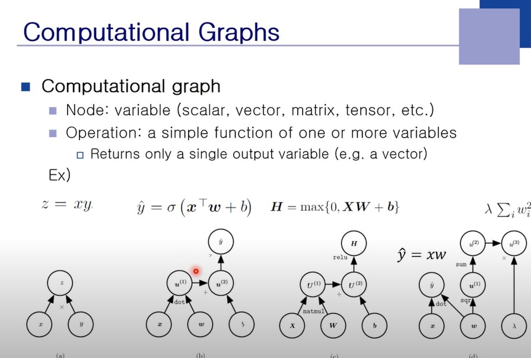

Computational Graph
Neural Network는 Computational Graph로 표현이 된다. (b)에서 시그마가 안들어간 이유는 벡터인 경우에는 시그마를 쓰지 않는다. 

----

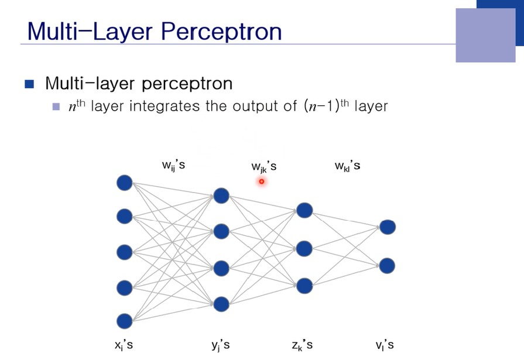
 
MultiLayer Perceptron은 하나의 층이 있지만 현재 layer의 규칙이 깨졌다. 중간에 건너뛰는 것이 가능해졌다는 것이다. 전통적으로 신경망은 Array다라고 헀지만 일반적인 Graph의 형태를 NN이 가질 수 있다. Self Link Node가 될 수도 있고 굉장히 다양하다. Layer의 Array로 구현할 수 없는 Computation Graph로 표현할 수 있다. 

----

 
 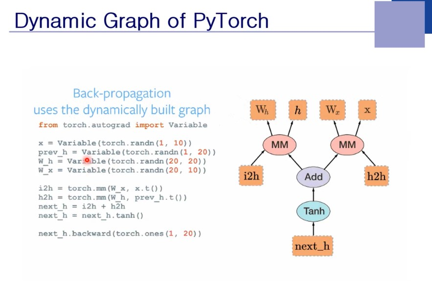

그 순간에 다이나믹하게 Node가 만들어진다. 동일한 Layer를 계속 반복하고 싶을 때가 있다고 가정해보면 고정된 그래프에서는 힘듦을 알 수 있다. 이 경우 루프의 연산을 하면서 해당 그래프만 그리면 빠르게 수행할 수 있다는 것이다. Static 보다 Dynamic함이 더 연산에 효율적이라는 것이다. 

----

 
 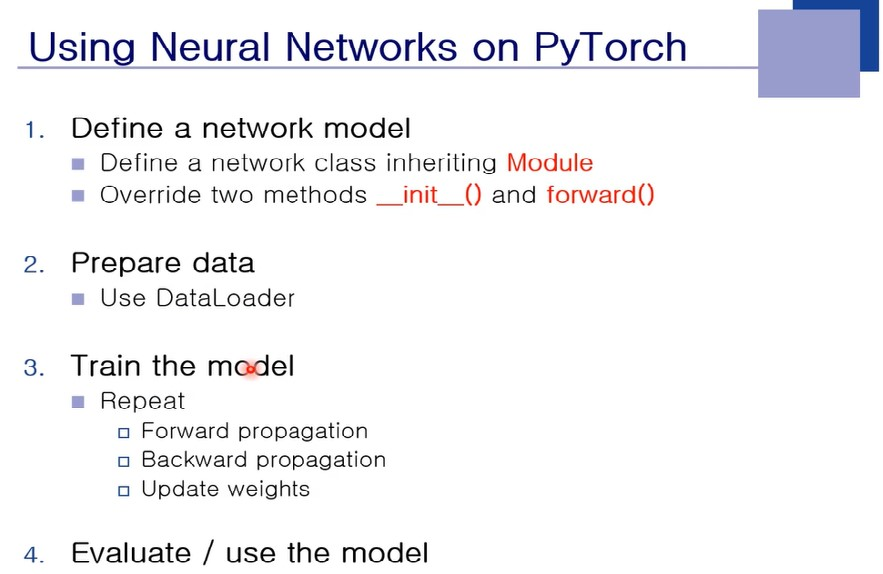

단순한 MLP만을 제공하는 사이키런과는 달리 PyTorch는 굉장히 복잡한 연산을 가능하게 해준다. PyTorch는 Neural Net의 다양한 Network를 사용할 수 있게 해준다. PyTorch로 Neural Net을 사용하는 방법은 다음과 같은 스텝을 가진다. 맨 처음 Neural Net을 정의해야 하는데 Class를 정의함으로서 정의할 수 있다. 두 번째로 Data를 읽어올 준비를 해야한다. 일정한 개수만큼 잘라서 Trainer한테 넣어주는 역할을 한다. 세 번째로 학습을 하는데, 크게 3단계로 이루어진다. Gradient 계산을 하고 현재의 Weight를 최신화하는 두 가지 과정을 거쳐야 한다. Back Propagation의 과정이 Gradient를 구하는 단계가 되고 Update weight를 하는 것은 Weight를 말그대로 최신화 시켜주는 것이다. Forward 에서 Output 결과를 계산하고 Back에서 Gradient를 계산하는 과정을 계속 반복하게 된다. 마지막으로 만들어낸 모델을 4번째에서 사용을 하는 것이다.

----

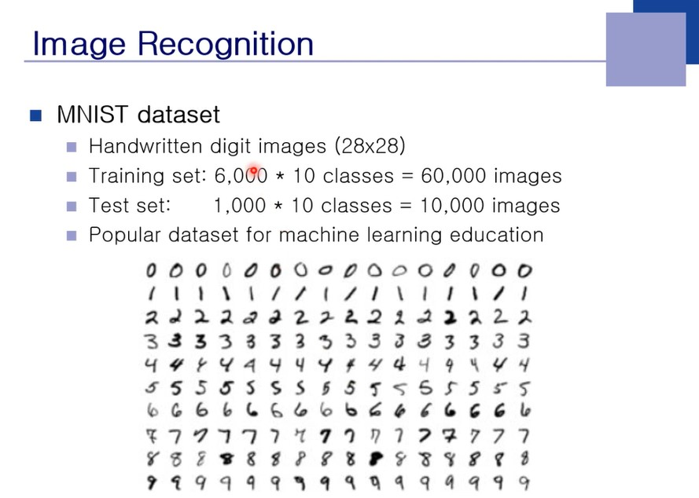 

필기 숫자 데이터를 가지고 학습을 시킨다. 

----

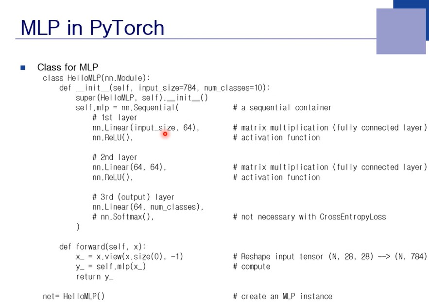

함수 정의와 클래스 정의하는 문법은 알고 있어야 한다. (굉장히 기본적인 파이썬 내용). 파이썬에서 상속을 받을 때 클래스를 정의할 때 파라미터에 상속받을 클래스 이름을 적어준다. 여기서는 nn.Module의 기능들을 상속받는다. 그렇다면 nn.Module은 무엇인가. 이는 PyTorch가 제공하는 패키지이다. 이 클래스는 Nueral Network의 Module을 표현하기 위한 Super 클래스가 된다. 대부분의 기능을 nn.Module이 갖고 있기 때문에 이 클래스를 상속받는 이유이다. __init__ 은 컨스트럭터이다. Self는 현재 오브젝트 자기자신을 나타내는 변수이다. Input_size=784 는 28 x 28의 값이 된다. 즉, 입력 영상의 데이터 값이 되고 num_class의 경우 숫자가 0에서 9까지의 총 10개의 클래스가 된다. Nn.Sequential은 연산에 필요한 Operator를 만드는 과정에 해당한다. Nn.Linear는 Weighted Sum을 계산하게 해준다. 입력크기와 출력 크기가 주어져야 한다. 여기서는 Input_size가 784고 출력은 64가 된다. 첫 번째 Layer의 Hidden Node의 개수가 64개가 된다. ReLU는 Activation Function에 해당한다. 계산 과정에서 Bias는 Linear Layer에 저장된다. Classification 문제의 경우 SoftMax Activation Function을 사용한다. 하지만 학습을 안하는 경우에는 SoftMax를 사용하지 않아도 된다. 최대값을 갖는 관점에서는 SoftMax가 사용되지 않아도 된다. (인식하는 경우) SoftMax는 학습할 때 필요하다. Cross Entropy를 사용하기 위해서 꼭 사용해야 하는데, 확률의 범위 안으로 들어가는 값으로 만들어줘야 하기 때문이다. 

 Sequential 클래스는 여러 개의 Layer를 일렬로 연결해주는 Container의 역할을 한다.
Forward 함수에서 x라는 입력값이 들어오면 x를 view라고 하는 함수에 집어넣는다. 일단 Batch의개념을 알아야 한다. 병렬처리의 이점을 최대로 살리기 위해 Training Sample을 동시적으로 넣게 되는데 병렬화가 많이 되면 GPU를 이용할 때 훨씬 빨라진다. Batch가 64개인 경우 28 x 28의 영상이 64개씩 들어온다. 실제 Dimention은 64D가 된다. 데이터가 64개 들어온다면 64D짜리가 64개 들어오게 되는 것이다. X의 크기는 (N,28,28) 이 된다. X의 타입은 Tensor이고 size() 를 하면 N번째 Dimention의 크기를 알려준다. X.size(0)은 batch 크기를 가져오라는 것이다. -1은 알아서 계산해달라는 것.  -1은 view 속에 딱 한 번만 사용할 수 있다. Size(0)은 배치 size(1)은 Width size(2)는 height가 된다. X_는 N 곱하기 784 Dimention으로 변환된 데이터이다. view라는 함수는 3차원 데이터를 2차원으로 바꿔줘야 한다. 2차원 데이터가 64개 있는  3차원을 2차원으로 바꿔주는 역할을 한다. 

컨스트럭터에서 파라미터에 Call된 숫자는 Default Parameter이므로 괄호가 사용되지 않을 때 자동으로 해당 값이 들어가게 된다. 

----

 
 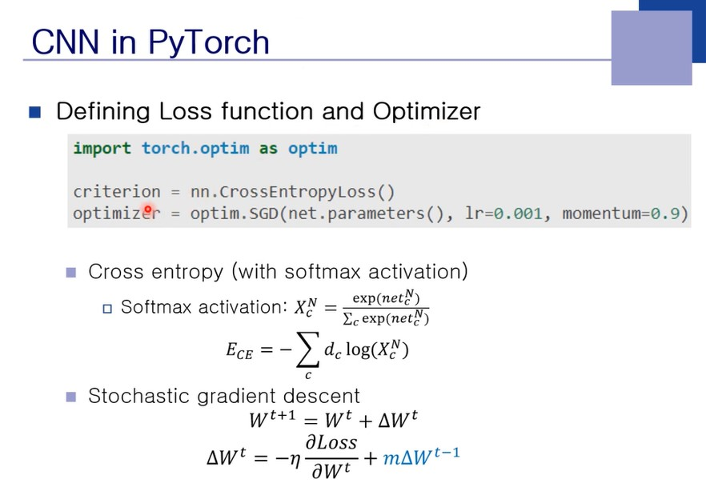

nn이라는 곳에서 Loss Function을 불러서 쓸 수 있다. SGD의 경우 Gradient를 업데이트하는 단위가 batch가 된다. 첫 번째 파라미터는 net.parameter 인데 사용되는 net은 이전에 정의한 Model의 객체 변수이고 parameters는 nn.Module 안에 들어있는 함수이다. 이 함수는 Weight 벡터를 List의 형태로 모아주는 함수이다. 즉, net.parameter 해당 벡터 데이터를 통째로 가져온다는 뜻이다. 

----

 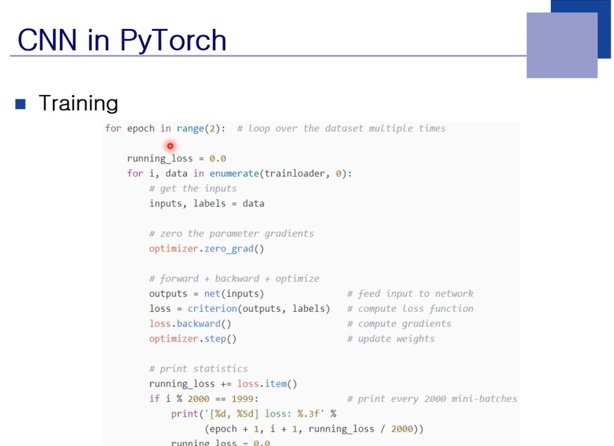

Trainloader라는 함수를 사용한다. 전체 데이터는 6만개이지만 여기에서는 64씩 데이터를 하나씩 쭉 제공하는 것이 trainloader 가 된다. Enumerate라는 함수는 해당 batch가 몇 번째 인지까지 정보를 받을 수 있다. 64개의 영상을 data로 받게 되면 64개의 input과 각각의 정답에 해당하는 label까지 저장이 된다. Optimizer.zero_grad는 Gradient는 Batch 단위 또는 그 이상의 단위에서 모아 업데이트를 하게 되는데 기존의 값이 있다면 더하는 로직으로 만들게 되어있다. Optimizer는 처음에 시작할 때 0으로 초기화를 해야하고, 업데이트가 끝났다면 이미 사용한 Gradient를 0으로 초기화를 해야 한다. Net(inputs)를 해주면 Forward 함수를 호출하게 된다. Criterion을 CrossEntropy로 정의를 했기 때문에 이를 사용해 ouputs과 label의 차이인 loss를 계산하게 된다. Loss.backward() 는 Back Propagation을 진행하게 된다. Loss에 대한 Back Propagation임을 주의하자. 다음으로 Optimizer.step인데, step이라는 함수는 Weight 업데이트를 해주는 함수가 된다. 

----

 
 

모델 저장하는 방법.

----

 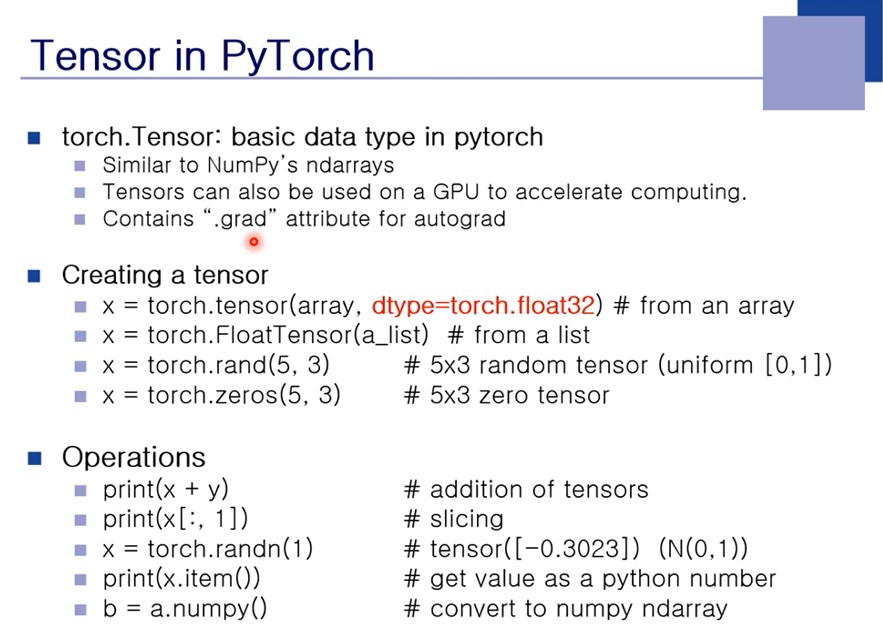

PyTorch가 제공하는 자동 미분 기능을 Tensor가 지원하고 있다. Tensor가 무슨 타입인지 지정할 수 있게 되어있다. 여기서는 torch.float32라고 많이 사용하고 있는데 GPU는 float32에서 속도가 빠르게 처리된다. List에 있는 value를 Tensor로 변환되는 FloatTensor를 사용할 수 있다. 많은 데이터가 리스트에 담겨있는데 이 방법은 PyTorch 안으로 데이터를 변환하기 위해 자주 사용되는 꼴이다. Rand() 와 zeros() 등등도 존재한다. Rand는 0에서 1사이의 임의의 값을 출력
Print(x+y) 에서 x와 y의 shape이 틀리면 BroadCasting 기능으로 자동 연산이 된다. X[;,1] 은 두 번째 Column이 된다. 이렇게 slicing을 하면 2차원 Tensor가 얻어지게 된다. Row차원이 콜론, 즉 Slicing이므로 차원이 줄지 않는다. Column은 Index이고 차원이 준다. 콜론이라는 것은 모든 row 또는 모든 col에서 데이터를 가져오라는 뜻. 모든 row에 대해서 1번째 col을 가져오는 것. 
Torch.randn()에서 n은 Normal (평균이 0이고 분산이 0인 곳)상태에서 랜덤하게 주어지게 된다. Rand의 범위는 0과 1 사이가 되고 Randn은  -1에서 1 사이가 된다. 
x.item()은 사이즈가 1인 Tensor의 value를 스칼라로 가져오는 함수!! 예를 들어 신경망에서 사이즈 1짜리 Tensor가 나왔다고 했을 때 그때의 값을 가져오고 싶을 때 item 함수를 사용한다.
A가 텐서라면 numpy로 변환해주는 함수가 .numpy가 된다. 

----

 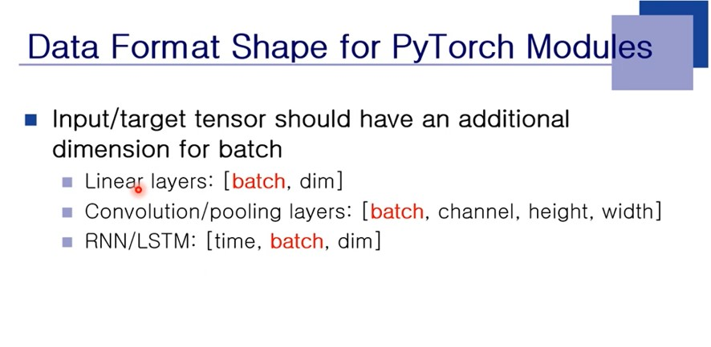

Batch는 한 덩어리에 들어오게 되는 데이터의 숫자. Convolution은 Layer자체가 3차원 구조를 가지고 channel, height, width의 데이터를 가진다. 한 데이터 마다 3차원의 구조를 가진다. RNN은 시간에 대한 축이 하나 더 들어간다. 
