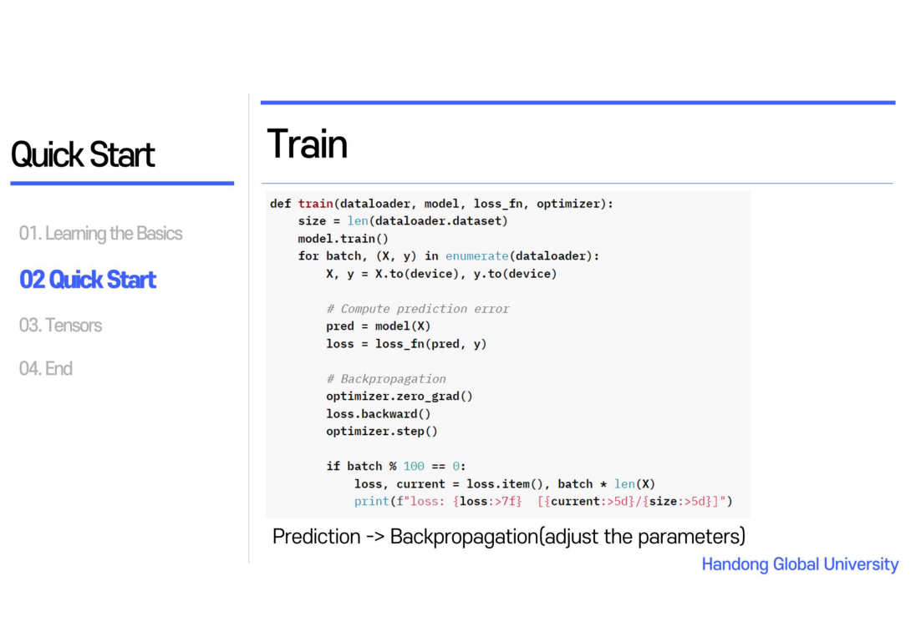

머신러닝의 워크플로우가 어떻게 돌아가는 지를 간단하게 알려줍니다.
데이터를 처리하고 모델을 생성하는 것, 그리고 모델 Parameter를 어떻게 최적화할지, 마지막으로
학습된 모델의 저장하기까지가  머신러닝의 워크플로우에 해당한다고 합니다.
그리고 PyTorch 학습 홈페이지 위에 존재하는 Run in Google Colab을 통해서 예시 코드를 시행해봤습니다.

데이터 작업을 위해 필요한 요소가 DataSet과 DataLoader라고 합니다. DataSet은 Sample과 Label (정답)
을 저장할 수 있는 것이고 DataLoader는 해당 DataSet을 순회가능한 객체로 감싼다고 합니다. 
순회 가능한 객체라는 것이 파라미터처럼 쓰일 수 있게 한다는 뜻으로 일단 이해를 했습니다. 그리고
DataSet 중 해당 튜토리얼에서는 TorchVision 데이터셋을 사용했습니다.

Dataset을 불러오기 위한 입력과 정답을 하나씩 불러주는 것이라고 하면 된다. 
DataLoader 의 iterable 즉 for문을 돌릴 수 있게 해준다. List 안에 있는 Element에 접근을 하는 것 처럼 DataLoader를 하게 되면
DataSet을 하나씩 매칭하게 되는 것. DataSet은 하나씩 불러오고 DataLoader는 Batch 사이즈

dataSet중 MNIST 데이터셋을 이용했으며 제일 위에 보이는 것이 MNIST라는 클래스가 어떤 파라미터를
가지고 있는지를 보여줍니다. Train 파라미터가 ture인 경우 왼쪽처럼 Training set을 생성하고 false의 경우
test set을 생성합니다.

그리고 앞에서 만들어진 DataSet이 파라미터처럼 사용이 되어 Dataloader의 인자로 전달되게 됩니다.

이렇게 Data 처리가 완료되었으면 모델을 만들어야 합니다. 우선 CUDA라는 GPU 환경을 사용합니다.
CUDA는 찾아본 결과 GPU 환경에서 사용하는 알고리즘을 C 또는 C++의 언어를 사용하여 작성할 수 있도록
해주는 기술이라고 찾게 되었습니다.

이제 Model define을 하게 되는데 __init__ 은 JAVA에서 컨스트럭터에 해당하는 것으로 nn.Module을 상속받아
이 super로 먼저 초기화를 해줍니다. 다음 flatten Layor를 사용하는데 이는 데이터를 일차원으로 바꿔주는
레이어라고 합니다. 이 튜토리얼에서 저희는 28x28 2D Image를 데이터로 사용하기 때문에 이를 일차원으로
가공할 필요에 따라 Flatten Layor를 사용한 것이라고 생각을 했습니다.

다음으로 Linear는 선형 변환을 시켜주는 작업으로 28x28 이미지의 데이터를 512개의 데이터로
Linear Transformation을 해주고 ReLU는 선형변환된 데이터 셋을 비선형화시켜 좀 더 복잡한 Mapping을
만들어 더 다양한 학습을 하기 위한 작업이라고 스터디를 했습니다.

Linear 앞은 입력 뒤는 출력, fully connected layor

모델을 만든 후 모델의 매개변수를 최적화하는 작업을 진행합니다. Loss function을 정의해야 하는데 여기에서
는 CrossEntropyLoss function을 사용했습니다. 이는 Entropy, 불확실성의 개념을 활용하여 예측값과
실제 값과의 차이를 오차로 두어 학습할 수 있는 방법입니다. 다음과 같은 수식으로 Loss를 
계산하게 되고 예를 들어 실제 값에 해당하는 것이 [0,0,1]의 확률이고 예측값에 대한 확률은 [0.1,0.2,0.7] 
이라고 했을 때 다음과 같이 계산이 되어 0.35라는 오차값을 갖게 되는 것입니다.

Optimizer는 Stochastic Gradient Descent 방법을 사용합니다. 전체 데이터에 해당하는 모든 loss를 계산하는
것이 아니라 mini Batch에 대한 loss를 계산하고, 이는 같은 시간 내에 연산량이 적기 때문에 더 많은
step을 이동할 수 있다라는 특징이 있다고 합니다. 왼쪽 그림을 보면 실제로 Stochastic Gradient Descent 방식이 더 많이 헤매는 것처럼 보이지만
훨씬 더 짧은 시간에 최적의 값에 도달할 수 있습니다. 그리고 Momentum의 방식을 사용할 경우 그래프에서
보이는 것처럼 Local minima에 갇히는 문제를 해결할 수 있는 효율적인 경우도 많아 진다고 합니다.

Loss function과 optimizer를 정의한 후 training loop를 돌게 됩니다. 먼저 Prediction Error를 수행합니다.
그리고 해당 오류를 Back Propagation을 거치면서 모델의 매개변수를 조정하는 과정을 거치게 됩니다.

test의 경우 모델의 학습 정도를 확인하기 위한 테스트 데이터셋으로 모델의 성능을 확인할 수 있는
loop가 되겠습니다.

Epochs를 총 5번 돌려서 확인을 할 수 있는 데 점점 갈수록 loss값이 줄어드는 것을 확인할 수 있고
Accuracy 또한 증가하는 것을 확인할 수 있습니다.

이렇게 만든 모델을 가지고 Classification 문제를 푸는 경우가 되겠습니다. 

Tensor라는 말이 익숙하지는 않지만 이는 배열이나 행렬과 매우 유사한 데이터 구조라고 보면 될 것 같습니다. 이는 모델의 Input과 Output 그리고 Parameter를 Encode하고 NumPy의 ndarray와 굉장히 유사하다고 합니다.

Tensor를 초기화하는 세 가지 방법을 소개합니다. 첫 번째는 데이터로부터 직접적으로 선언을 하는 방법입니다. 이때 Data Type은 자동으로 유추됩니다. 두 번째로 NumPy Array로부터 Tensor를 만드는 방법입니다. 아까 Tensor는 NumPy의 ndarray와 유사하다고 한 것으로부터 비슷하게 사용할 수 있음을 유추할 수 있습니다. 마지막으로 이미 정의된 Tensor로부터 새로운 Tensor를 만드는 방법입니다. Torch.ones_like의 경우 이미 위에서 정의된 x_data의 모양과 자료형을 유지한 채로 모든 요소를 1로 출력하게 합니다. 두 번째의 경우는 x_data의 속성을 torch.float로 덮어쓰고 rand_like로 난수를 출력하는 것입니다.
Tensor는 GPU에 올려서 작업하기 최적화 되어 있다. CPU에서는 하나씩 연산을 하지만 GPU에서는 단순한 코어들이 많으니 값을 하나씩 올리는데 이것을 NumPy array로는 할 수 없다.
NumPy array는 CPU에서 작업하기 편한 형태이다. NumPy 형태로 DataLoader를 하게 되고 Tensor로 바꿔주는 작업을 해야 딥러닝에 입력을 할 수 있다.

Shape은 Tensor의 차원을 나타내는 것으로 다음과 같은 코드에서는 출력 Tensor의 차원을 결정합니다.

다음으로 알아야 하는 것은 Tensor의 속성입니다. 텐서의 모양, 자료형 그리고 어느 장치에 저장되는지를 나타내주는 속성입니다. 모두 출력할 때 tensor.shape, tensor.dtype, tensor.device로 표현하면 각각을 알 수 있습니다.

Tensor의 연산과 관련된 부분입니다. 아직은 모든 연산에 대해서 모르지만 수학 계산, 선형 대수, 임의의 샘플링 등 100가지 이상의 Tensor 연산이 있습니다. 현재 저는 Colab을 사용하기 때문에 Edit -> Notebook Setting에서 GPU 설정을 통해 CPU보다 빠른 연산처리를 가능하게 하는 세팅을 해줬습니다. 기본적으로 Tensor는 CPU에 생성이 되는데 아래에 보이는 코드처럼 .to 메소드를 사용하면 GPU가 available한 지를 확인하고 Tensor를 GPU로 이동시켜줍니다. 하지만 이때 주의할 점은 큰 Tensor를 복사할 때는 시간과  메모리 측면의 비용이 많이 드는 점입니다.

Tensor를 합치는 방법이 있는데 C에서 존재하는 strcat과 비슷하다 생각을 했습니다.
Torch.cat에서 주어진 dimension에 따라 일련의 Tensor들을 연결할 수 있습니다.
또한 산술 연산도 가능한데 행렬간 곱과 요소별 곱셈을 계산할 수 있습니다. 보면 tensor의 @가 있고 Matrix Multiplication의 약자를 따서 matmul을 사용하기도 하는 것을 볼 수 있습니다. 요소별 곱셈에서는 흔히 알고 있는 곱셈 연산자 *와 mul을 사용합니다.

Tensor의 모든 값을 하나로 sum 메소드를 통해  aggregate(집계)할 수 있고 만약
요소가 하나인 Tensor인 경우 item() 메소드를 사용해 Python 숫자 값으로 변환할 수 있습니다. Tensor를 출력하기 위해서 print(tensor)를 하면 다음과 같은 출력을 할 수 있는데 여기서 add 메소드에 _ (Under Bar) 접미사를 같이 사용하면 5만큼 더한 Tensor를 출력할 수 있습니다. 하지만 이렇게 바로 바꾸는 In-Place operation은 메모리를 절약할 수 있지만 기록이 즉시 삭제되어 도함수 계산에 문제가 발생할 수 도 있습니다.

다음 코드에서는 Tensor와 NumPy간의 변환을 볼 수 있는데 Tensor를 t 변수에 담아 출력한 후 이를 t.numpy를 사용하여 NumPy array로 변경이 가능합니다.  이는 Tensor와 NumPy array가 그들의 메모리 장소를 공유하기 때문입니다. 만일 Tensor의 값에 1을 추가하게 된다면 같은 메모리의 값도 In-Place되어 NumPy의 array도 출력을 해보면 변경되어 있음을 알 수 있습니다.

반대로 NumPy 배열로 5만큼의 크기의 1로 초기화된 배열을 선언하고 Tensor로 변경해 t 변수에 담아줍니다. 아래에서 보면 NumPy 배열에 1을 더해주면 Tensor의 값도 변경된 것을 확인할 수 있습니다.
여기까지 오늘 제 발표를 마치겠습니다.

